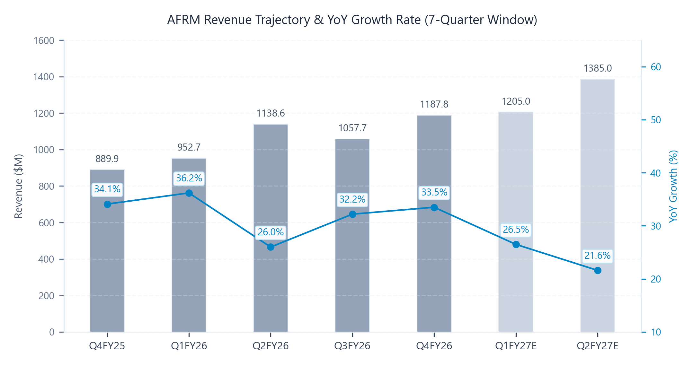
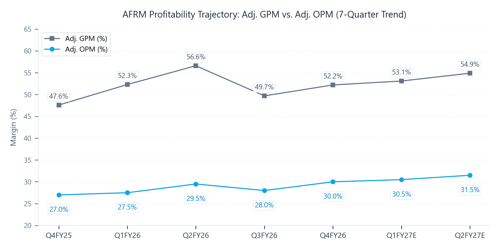

# Affirm Holdings, Inc. (AFRM) Q4 FY26 Earnings Update
2026년 9월 3일

### Executive Snapshot
- 기준일자: 2026년 9월 3일
- 사업분야: 핀테크 / 후불결제(BNPL) 및 디지털 결제 네트워크 플랫폼
- 현재주가: 74.12 USD (전일 공식 종가 기준)
- 실적반응: 실적 발표 직후 호실적 및 사상 최대 흑자 달성으로 시간외 +8.5%, 익일 장중 +13% 급등(종가 84.43 USD) 후 74 USD선 안착
- 적정주가: 106.80 USD (현재 주가 대비 +44.1%)
- 산정근거: FY27E EPS 2.67 USD * Target P/E 40.0x

## ▌ 01. Executive Summary

- [실적 더블 비트] 4분기 매출 1,187.8M USD (컨센서스 1,110.0M USD 대비 +7.0% 상회, YoY +33.5%) 및 Non-GAAP 기준 본업 희석 EPS 0.36 USD (컨센서스 0.25 USD 대비 +44.0% 상회) 기록하며 시장 기대치 대폭 상회.
- [핵심 사업부 고성장] 총 상품 거래액(GMV) 14.1B USD (YoY +36.0%) 달성. 특히 Affirm Card GMV가 2.8B USD로 전년동기 대비 +124.0% 폭증하며 전체 외형 확장의 핵심 모멘텀으로 안착.
- [수익성 체질 개선] 조정 영업이익률(Adj. OPM) 30.0% (YoY +300bp) 달성으로 분기 사상 최대 본업 흑자(Adj. OI 356.3M USD) 경신. 이연법인세자산 평가충당금 환입(1,447.5M USD) 효과를 배제하더라도 역대 최고 수준의 구조적 수익성 레버리지 입증.
- [가이던스 대폭 상향] FY27 연간 GMV 목표치를 기존 시장 기대치(약 58.5B USD) 대비 대폭 상향한 64.0B USD 이상으로 제시. 거래비용 차감 후 수익(RLTC) 테이크레이트 4.16% 락인 및 연간 Adj. OPM 30.5% 이상을 가이드하며 중장기 눈높이 상향 견인.

### Q4 FY26 Results Summary Table (Non-GAAP 기준)

| 단위: M$ | 실제 | 컨센서스 | vs 컨센 | YoY | QoQ |
| :--- | :---: | :---: | :---: | :---: | :---: |
| 매출 | 1,187.8 | 1,110.0 | +7.0% | +33.5% | +12.3% |
| Adj. GP | 620.5 | 582.0 | +6.6% | +31.8% | +18.1% |
| Adj. GPM | 52.2% | 52.4% | -20bp | -70bp | +250bp |
| Adj. OI | 356.3 | 288.6 | +23.5% | +48.3% | +20.3% |
| Adj. OPM | 30.0% | 26.0% | +400bp | +300bp | +200bp |
| Adj. NI | 126.8 | 87.5 | +44.9% | +83.2% | +23.2% |
| Adj. EPS ($) | 0.36 | 0.25 | +44.0% | +80.0% | +20.0% |
| Adj. EBITDA | 382.4 | 315.0 | +21.4% | +44.3% | +19.1% |
| FCF | 215.6 | 165.0 | +30.7% | +62.1% | +28.3% |

*(참고: 당분기 GAAP 당기순이익은 1,616.6M USD, GAAP 희석 EPS는 4.62 USD이나, 이는 1,447.5M USD의 이연법인세자산 평가충당금 환입에 기인한 일회성 회계 효과이므로, 시장 컨센서스와의 1:1 동종 비교를 위해 상기 표는 런레이트 유효세율 25%를 적용한 순수 본업 기반 Non-GAAP 실적으로 정렬)*

- Affirm Card 결합률(Attach Rate) 19% 도달 및 오프라인 GMV 폭발: 일반 고객 대비 카드 고객의 연간 지출액이 2배에 달하며, 온라인 대비 3 - 4배 큰 오프라인 상거래 시장으로의 성공적 침투를 통해 고성장 지속성 확보.
- 고마진 이자부(Interest-Bearing) 대출 비중 확대 및 자본조달 안정성: D2C 및 카드 기반 이자부 대출 비중이 80%를 상회하며 RLTC 테이크레이트 4.19% 달성. 비연결 ABS 발행을 통한 조달비용 안정화로 스프레드 마진 방어.
- 네트워크 효과의 본격적 퀀텀점프 구간 진입: 상위 250대 전자상거래 사이트 중 80개사(침투율 32%) 및 전체 가맹점의 10%에 불과한 초기 침투율에도 불구하고, 활성 소비자 기반 확대와 가맹점 자동 온보딩 구축으로 거래 빈도가 가속화되는 선순환 체제 확립.

## ▌ 02. 매출성장 및 분기별 궤적 분석

| 단위: M$ | Q4FY25 | Q1FY26 | Q2FY26 | Q3FY26 | Q4FY26 | Q1FY27E | Q2FY27E |
| :--- | :---: | :---: | :---: | :---: | :---: | :---: | :---: |
| 매출 | 889.9 | 952.7 | 1,138.6 | 1,057.7 | 1,187.8 | 1,205.0 | 1,385.0 |
| YoY | +34.1% | +36.2% | +26.0% | +32.2% | +33.5% | +26.5% | +21.6% |
| QoQ | +13.5% | +7.1% | +19.5% | -7.1% | +12.3% | +1.4% | +14.9% |

- 전년동기 대비 +33.5% 성장한 1,187.8M USD 기록하며 연중 최고 매출 달성. 계절적 비수기인 직전 분기(-7.1% QoQ) 대비 +12.3% QoQ 성장하며 즉각적인 V자 반등 완결.
- 대형 가맹점의 상시 Pay in 4 도입 확대와 'The Big Nothing' 무이자 프로모션 집행에 힘입어 POS 결제 연동 거래액 급증.
- D2C 및 Affirm Card의 지속적인 스케일업으로 카드 GMV가 전년 대비 +124.0% 급증한 2.8B USD를 기록하며 전체 성장의 앵커 역할 수행.
- Crate & Barrel 등 신규 엔터프라이즈 가맹점 런칭 프로세스 자동화로 온보딩 즉시 실질 거래액 창출. 서비스(Services) 버티컬 거래량 역시 대형 플랫폼 계약 체결로 2배 가까이 성장하며 카테고리 다변화 성공.

## ▌ 03. 수익성 및 영업이익률(OPM) 진단

| 단위: M$ | Q4FY25 | Q1FY26 | Q2FY26 | Q3FY26 | Q4FY26 | Q1FY27E | Q2FY27E |
| :--- | :---: | :---: | :---: | :---: | :---: | :---: | :---: |
| Adj. GP | 470.8 | 498.6 | 645.0 | 525.3 | 620.5 | 640.0 | 760.0 |
| Adj. GPM | 47.6% | 52.3% | 56.6% | 49.7% | 52.2% | 53.1% | 54.9% |
| Adj. OI | 240.3 | 262.0 | 335.9 | 296.2 | 356.3 | 367.5 | 436.3 |
| Adj. OPM | 27.0% | 27.5% | 29.5% | 28.0% | 30.0% | 30.5% | 31.5% |
| GAAP OPM | 8.0% | 8.7% | 11.7% | 10.2% | 14.2% | 14.5% | 16.0% |
| Cons. OPM | 26.5% | 27.0% | 28.5% | 27.8% | 26.0% | 29.5% | 30.8% |

### 마진 궤적 및 수익성 동인 분석

- 마진 궤적 판정: 영업이익률 추가 확장(Expansion) 구간 안착. 당분기 조정 영업이익률 30.0%로 직전 분기 대비 +200bp, 전년동기 대비 +300bp 급등하며 사상 최고치 경신. FY27 연간 가이던스로도 30.5% 이상을 제시하여 마진 체질의 구조적 개선 확정.
- GAAP 대비 Non-GAAP 마진 격차 원인(Reconciliation Bridge): 당분기 GAAP 영업이익률(14.2%)과 조정 영업이익률(30.0%) 간의 1,580bp 격차는 주로 주식기준보상비용(SBC) 165.0M USD (마진 영향 약 1,389bp), 기술 및 플랫폼 무형자산 감가상각비 22.2M USD (마진 영향 약 187bp), 기타 일회성 구조조정 비용 4.0M USD (마진 영향 약 34bp)에 기인.
- 조달비용(Funding Costs) 및 RLTC 방어: 4분기 부채 자본 시장(DCM) 내 비연결 ABS 발행 2건 성공적 집행으로 자본 기반 확충. 조달비용률을 안정적으로 유지하며 RLTC 589.0M USD(테이크레이트 4.19%) 달성.
- 실시간 신용 리스크 제어력: 분기 대손충당금 전입액 223.2M USD(매출 대비 18.8%) 집행. 분기당 1억 회에 달하는 개별 거래 실시간 심사를 통해 연체율(DQs)을 경영진 통제 범위 내에서 안정적으로 관리.
- 이연법인세자산 평가충당금 환입 효과: 누적 결손금으로 인해 과거 설정되었던 법인세 평가충당금 1,447.5M USD가 당분기 전액 환입되며 GAAP 기준 당기순이익 1,616.6M USD를 기록. 이는 향후 Affirm의 지속적인 과세소득 창출 능력에 대한 회계적 공인 의미 보유.

## ▌ 04. 가이던스 리비전 및 밸류에이션 (Guidance Revisions & Valuation)

### 실적 발표 전후 눈높이 변동 (컨센서스 vs 가이던스 반영)

| 주요 지표 | 기존 컨센서스 | 가이던스 반영 | 변동률 |
| :--- | :---: | :---: | :---: |
| 12개월 적정주가 | $88.50 | $106.80 | +20.7% |
| FY27E 매출 | $5,120M | $5,410M | +5.7% |
| FY27E EBITDA | $1,480M | $1,750M | +18.2% |
| FY27E EPS | $2.15 | $2.67 | +24.2% |
| FY28E 매출 | $6,250M | $6,780M | +8.5% |
| FY28E EBITDA | $1,920M | $2,340M | +21.9% |
| FY28E EPS | $2.95 | $3.65 | +23.7% |

### 리비전 핵심 동인 및 3대 투자 함의

-[단기 눈높이 변동 동인] 1분기(Q1 FY27) 매출 가이던스 1,190M - 1,220M USD (중간값 1,205M USD) 및 연간 GMV 64.0B USD 이상 제시로 기존 시장 추정치 대폭 상회. 연간 RLTC 테이크레이트 4.16% 및 조정 영업이익률 30.5% 이상 가이드로 단기 실적 가시성 확보.
-[중장기 눈높이 변동 동인] Affirm Card 결합률 19% 도달 및 오프라인 상거래 침투 본격화, Visa Flexible Credential(VFC) 기반 독보적 0% 무이자 혜택 독점으로 카드당 지출액 2배 확대 지속. 영국 시장 조기 안착 및 대형 엔터프라이즈 가맹점 파이프라인 확대로 3개년 CAGR 20% 중반 성장 가도 유지.
-[적정주가 및 밸류에이션 결론] 강력한 영업 레버리지와 사상 최대 영업이익률 달성에 따른 FY27E Non-GAAP EPS 추정치 상향(+24.2%)을 반영하여 적정주가를 기존 88.50 USD에서 106.80 USD로 +20.7% 상향 조정.

### 적정주가 민감도 매트릭스

| 타깃 P/E | Bear Case ($2.30) | Base Case ($2.67) | Bull Case ($3.05) |
| :--- | :---: | :---: | :---: |
| 35.0x | $80.50 (+8.6%) | $93.45 (+26.1%) | $106.75 (+44.0%) |
| 40.0x | $92.00 (+24.1%) | $106.80 (+44.1%) | $122.00 (+64.6%) |
| 45.0x | $103.50 (+39.6%) | $120.15 (+62.1%) | $137.25 (+85.2%) |

### 밸류에이션

- [주당순이익(P/E) 밸류에이션] FY27E 예상 Non-GAAP EPS 2.67 USD에 타깃 P/E 40.0x 배수를 적용하여 적정주가 106.80 USD 도출.
- [현재 주가 대비 상승 여력] 현재 전일 종가(74.12 USD) 대비 산출된 적정 가치의 상승 여력(+44.1%) 제시로 분석 완결.

## ▌ 05. 주요 질의응답

- 신용 리스크 관리 기조 및 신용 기준(Credit Box) 완화 여부 (CEO Max Levchin):
  - 대외 불확실성 속에서 신용 기준을 완화할 계획이 있는지에 대한 질문에 대해, 경영진은 신용 목표를 사업의 산출물이 아니라 투입물(input)로 규정함.
  - 분기당 약 1억 회에 달하는 개별 거래를 실시간으로 언더라이팅하며 yes/no를 직접 통제하는 고도로 미분 가능한 곡선을 구축하고 있으므로, 신용 불안정이 발생하기 전에 성장을 먼저 제어할 수 있는 완전한 통제력을 보유하고 있음을 강조.
- Affirm Card 오프라인(In-store) 침투 및 결합률(Attach Rate) 확대 전략 (CEO Max Levchin):
  - 카드 활성 결합률 19% 도달과 함께 일반 사용자 대비 2배 높은 지출액을 확인 중.
  - 매장 내 네트워크 음영 문제 및 레거시 POS 시스템 바코드 연동 등 오프라인 특유의 마찰 요인을 기술적으로 제거 중이며, Visa 유연 자격증명(VFC) 기반으로 가맹점이 비용을 부담하는 실질 8% - 15% 상당의 0% 무이자 할부 프로그램을 카드 전용으로 결합하여 침투를 가속화할 방침.
- 거래비용 차감 후 수익(RLTC) 테이크레이트 및 조달비용 전망 (CFO Rob O'Hare):
  - 2027 회계연도 RLTC 가이던스(4.16%)가 기존 중기 목표 범위(3.25% - 4.0%) 상단에 위치한 배경에 대해, 부채 자본 시장(DCM) 내 탁월한 실행력으로 비연결 ABS 발행 2건을 포함해 안정적 조달비용 구조를 확립했음을 설명.
  - D2C 및 카드 확대로 80% 이상을 차지하는 이자부 대출 믹스가 유지되고 소비자 신용 건전성이 뒷받침됨에 따라 고마진 테이크레이트의 지속성을 확신함.

## ▌ 06. 리스크 요인 및 모니터링 지표

- 거시경제 둔화 및 중저소득층 차주 연체율 급증 리스크: 고금리 지속 및 가계 저축 소진 시 중저신용 차주의 결제 연체율(DQs) 상승 및 대손충당금 전입액 부담 증가 가능성. (트래킹 지표: 분기별 순차손율 Net Charge-off Rate, 30일 이상 연체율 추이)
- 대형 가맹점 집중도 및 파트너십 재계약 마진 압박: Amazon, Shopify 등 최상위 파트너십 갱신 과정에서 가맹점 수수료(MDR) 인하 압박 및 경쟁사의 프로모션 공세로 인한 테이크레이트 훼손 가능성. (트래킹 지표: 상위 가맹점 GMV 집중도, RLTC 테이크레이트 분기별 추이)
- 빅테크 및 글로벌 카드사의 BNPL/직불 플렉스 카드 시장 진입 경쟁: Apple, Klarna 및 기존 대형 상업은행들의 무이자 할부 직불카드 출시 확대에 따른 가맹점 및 사용자 유치 비용 상승 가능성. (트래킹 지표: 활성 소비자 수 순증세, 가맹점 수, 사용자당 연간 거래 빈도)
