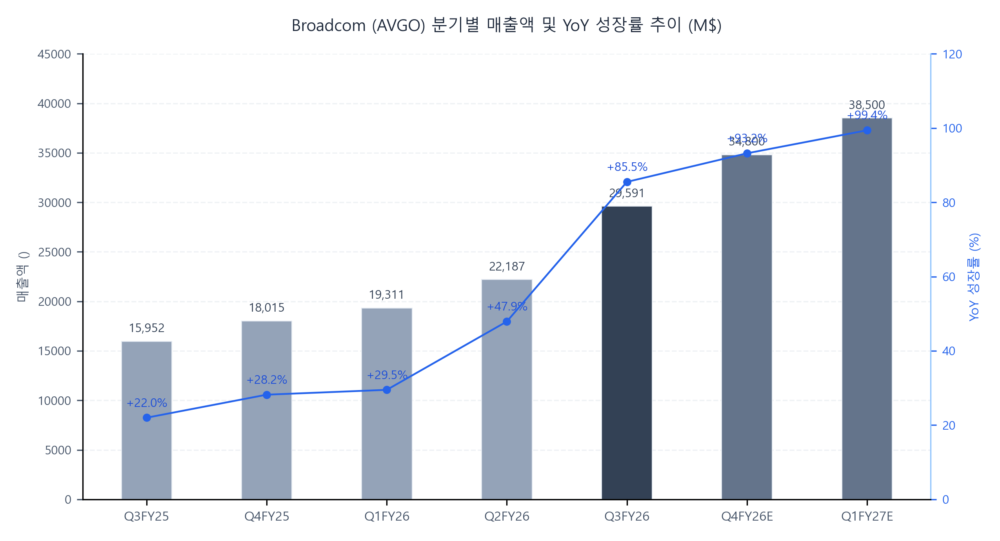
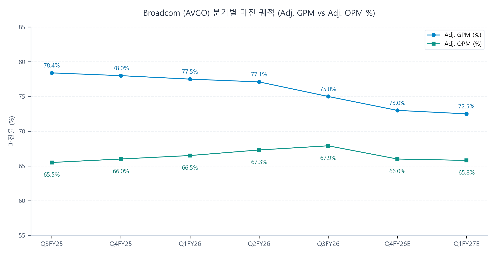

# Broadcom Inc. (AVGO) Q3 FY26 Earnings Update
브로드컴 FY26-Q3 실적 분석 및 핵심 지표 리뷰

2026-09-03

### Executive Snapshot
- 기준일자: 2026년 9월 3일
- 사업분야: 커스텀 AI 가속기(XPU), AI 네트워킹(Tomahawk/PCIe/Optics), 엔터프라이즈 인프라 소프트웨어(VMware VCF)
- 현재주가: 354.43 USD (실적 직후 시간외 -3.56% / 정규장 367.51 USD)
- 적정주가: 450.00 USD (현재 주가 대비 +27.0%)
- 산정근거: FY28E EPS 30.00 USD 초과 달성 가이던스 및 커스텀 XPU 시장 지배력 반영한 Target P/E 23.0x 적용

## ▌ 01. Executive Summary

### 핵심 실적 하이라이트
- [실적 더블 비트] Q3 FY26 연결 매출액 29,591M USD(YoY +85.5%, QoQ +33.4%), Non-GAAP Diluted EPS 3.32 USD(YoY +96.5%)를 기록하며 블룸버그 집계 시장 컨센서스(매출 29,450M USD, EPS 3.23 USD)를 각각 +0.5%, +2.8% 상회하는 사상 최대 분기 실적 달성.
- [핵심 사업부 고성장] 반도체 솔루션 부문 매출이 YoY +127% 급증한 20,839M USD를 기록하였으며, 이 중 AI 반도체 매출이 YoY +221%, QoQ +54% 폭증한 16,700M USD로 전사 매출 비중의 56%를 차지하며 폭발적 외형 성장 견인.
- [수익성 체질 개선] 고부가 XPU 비중 확대 및 HBM 고용량 메모리 탑재로 Non-GAAP GPM은 75.0%(YoY -3.4%p, QoQ -2.1%p)로 소폭 희석되었으나, 압도적인 영업 레버리지(반도체 부문 OpEx 비율 6% 억제)에 힘입어 Non-GAAP OPM 67.9%(YoY +2.4%p)로 사상 최고치 경신 및 분기 FCF 13,665M USD(YoY +94.6%) 창출.
- [가이던스 대폭 상향] FY26 연간 AI 매출 전망치를 종전 56,000M USD에서 58,000M USD(YoY +186%)로 +2,000M USD 상향 조정하였으며, FY27 1,150억 달러(115B USD, 2배 성장) 및 FY28 2,300억 달러(230B USD, 2배 성장)에 달하는 2개년 총 3,500억 달러 AI 반도체 수주 가시성과 FY28 EPS 30 USD 돌파 목표 공식 천명.

### Q3 FY26 Results Summary Table (Non-GAAP 기준)
| 단위: M$ | 실제 | 컨센서스 | vs 컨센 | YoY | QoQ |
| :--- | :---: | :---: | :---: | :---: | :---: |
| 매출 | 29,591 | 29,450 | +0.5% | +85.5% | +33.4% |
| Adj. GP | 22,191 | 21,793 | +1.8% | +77.5% | +29.7% |
| Adj. GPM | 75.0% | 74.0% | +1.0%p | -3.4%p | -2.1%p |
| Adj. OI | 20,095 | 19,643 | +2.3% | +92.2% | +34.6% |
| Adj. OPM | 67.9% | 66.7% | +1.2%p | +2.4%p | +0.6%p |
| Adj. NI | 16,372 | 15,950 | +2.6% | +94.8% | +35.6% |
| Adj. EPS ($) | 3.32 | 3.23 | +2.8% | +96.5% | +36.1% |
| Adj. EBITDA | 20,266 | 19,800 | +2.4% | +92.0% | +34.2% |
| FCF | 13,665 | 12,500 | +9.3% | +94.6% | +33.2% |

### Key Takeaways
- 프론티어 AI 랩 4대 고객 락인과 기하급수적 커스텀 XPU 출하 가속: 구글 TPU v7 대량 공급 및 TPU v8i 양산 조기 출하 개시, 앤트로픽 Ironwood 본격 배포(2026년 1GW -> 2027년 5GW -> 2028년 10GW 추가 증설로 브로드컴 최대 XPU 고객 등극), 오픈AI 1세대 Halapeno 출하 개시(2027년 1.3GW -> 2028년 5GW+ 확보, Grace Blackwell 대비 추론 성능 및 전력 우위 입증, 2위 고객 등극), 메타 MTIA 3개 세대에 걸쳐 2028년까지 3GW 배치 확보.
- 네트워킹 및 광학 인터커넥트 풀스택 기술 격차 확대: 업계 최초 초당 200테라비트 이더넷 스위치 토마호크 7(Tomahawk 7) 발표 및 토마호크 6 전 AI 하이퍼스케일러 완판, 저지연 이더넷 기반 토마호크 울트라(Tomahawk Ultra)로 GPU/XPU 랙 내부 스케일업(Scale-up) 시장까지 개방형 이더넷 표준으로 장악 개시, EML/CW 레이저 공장 생산 능력 3배 증설로 광학 병목 완벽 선점.
- 혁신적 부외 금융 플랫폼(AI XPV)과 구조적 해자 안착: 아폴로/블랙스톤과 합작한 AI XPV 플랫폼을 통해 앤트로픽 1차 트랜치 350억 달러 펀딩 완료, AI 스타트업들의 대규모 선행 인프라 투자 부담을 부외(Off-balance sheet) 구조로 해결하며 수요를 조기 결박, 싱가포르 기판(Substrate) 팹 2027 회계연도 가동으로 CoWoS 첨단 패키징 공급망 병목 자체 해소.

## ▌ 02. 매출성장 및 분기별 궤적 분석

| 단위: M$ | Q3FY25 | Q4FY25 | Q1FY26 | Q2FY26 | Q3FY26 | Q4FY26E | Q1FY27E |
| :--- | :---: | :---: | :---: | :---: | :---: | :---: | :---: |
| 매출 | 15,952 | 18,015 | 19,311 | 22,187 | 29,591 | 34,800 | 38,500 |
| YoY | +22.0% | +28.2% | +29.5% | +47.9% | +85.5% | +93.2% | +99.4% |
| QoQ | +6.3% | +12.9% | +7.2% | +14.9% | +33.4% | +17.6% | +10.6% |

### 세그먼트별 매출 동인 분석
- 반도체 솔루션 (Semiconductor Solutions): 매출액 20,839M USD(YoY +127%, QoQ +38.6%)를 기록하며 전사 매출의 70%를 차지.
(1) AI 반도체: 매출 16,700M USD(YoY +221%, QoQ +54%)로 전사 매출의 56% 비중 도달. 앤트로픽 및 구글향 TPU v7(Ironwood) 대량 출하, 구글 차세대 TPU v8i 양산 조기 출하, 오픈AI 1세대 가속기 Halapeno 공급 본격화에 기인. Q4 FY26 가이던스는 21,700M USD(YoY +236%)로 추가 가속화 제시.
(2) 비AI 반도체: 매출 4,139M USD(YoY +5%, QoQ 보합) 기록. 브로드밴드 및 서버 스토리지 부문의 점진적 업턴 수요가 무선(Wireless) 부문의 계절적 둔화를 흡수하며 바닥 탈출 확인. Q4 FY26 가이던스는 4,300M USD(QoQ +5%)로 회복세 지속 전망.
- 인프라 소프트웨어 (Infrastructure Software): 매출액 8,752M USD(YoY +29%, QoQ -0.6%)를 기록하며 전사 매출의 30% 구성.
(1) VMware 인수 시너지 안착: 구독 라이선스 전환을 통해 연간 반복 매출(ARR)이 전년동기 대비 +15% 성장 지속.
(2) 엔터프라이즈 AI 플랫폼 확장: VMware Private AI Cloud 출시로 기업들의 기존 온프레미스 인프라 내 프라이빗 AI 구축 수요를 견인. VCF(VMware Cloud Foundation) 도입을 바탕으로 퍼블릭 클라우드에서 프라이빗 환경으로의 워크로드 온프레미스 회수(Repatriation) 가속화. Q4 FY26은 8,700M USD 수준으로 안정적 안착 전망.

## ▌ 03. 수익성 및 영업이익률(OPM) 진단

| 단위: M$ | Q3FY25 | Q4FY25 | Q1FY26 | Q2FY26 | Q3FY26 | Q4FY26E | Q1FY27E |
| :--- | :---: | :---: | :---: | :---: | :---: | :---: | :---: |
| Adj. GP | 12,499 | 14,052 | 14,966 | 17,109 | 22,191 | 25,404 | 27,913 |
| Adj. GPM | 78.4% | 78.0% | 77.5% | 77.1% | 75.0% | 73.0% | 72.5% |
| Adj. OI | 10,455 | 11,890 | 12,842 | 14,928 | 20,095 | 22,968 | 25,333 |
| Adj. OPM | 65.5% | 66.0% | 66.5% | 67.3% | 67.9% | 66.0% | 65.8% |
| GAAP OPM | 36.9% | 41.7% | 44.3% | 48.6% | 53.9% | 52.5% | 53.0% |
| Cons. OPM | 65.2% | 65.8% | 66.0% | 66.8% | 66.7% | 66.2% | 65.8% |

### 마진 궤적 및 수익성 동인 분석
- 마진 궤적 판정: 고점 횡보(High-level Plateau / Range-bound) 및 영업 레버리지 극대화 구간 안착.
(1) GPM 믹스 희석 요인: Non-GAAP GPM은 Q3FY25 78.4%에서 Q3FY26 75.0%로 하락하였으며, Q4 FY26 가이던스는 73.0%로 제시. 이는 고마진 인프라 소프트웨어 대비 마진율이 상대적으로 낮은 커스텀 XPU 가속기 매출 비중의 급증(전사 56% 돌파) 및 HBM 고용량 메모리 탑재에 따른 원가 부담 확대에 기인.
(2) OPM 방어 및 구조적 레버리지: GPM 희석에도 불구하고 Non-GAAP OPM은 67.9%(YoY +2.4%p, QoQ +0.6%p)로 사상 최고치를 경신. 반도체 솔루션 부문 매출이 전년 대비 +127% 폭증하는 동안 영업비용(OpEx)은 1,200M USD로 +22% 증가에 그치며 부문 OpEx 비율이 6%까지 하락. 매출 성장이 비용 증가를 압도하는 탁월한 영업 레버리지가 마진율을 지탱.
- GAAP vs Non-GAAP Reconciliation Bridge:
GAAP 영업이익(15,955M USD, OPM 53.9%)과 Non-GAAP 영업이익(20,095M USD, OPM 67.9%) 간의 4,140M USD(14.0%p) 격차는 3대 핵심 항목으로 구성.
(1) 인수 관련 무형자산 상각비: 2,006M USD (매출 대비 6.8%p 영향, VMware 인수 무형자산 상각 중심).
(2) 주식기준보상비용(SBC): 2,019M USD (매출 대비 6.8%p 영향).
(3) 구조조정 및 기타 비용: 115M USD (매출 대비 0.4%p 영향).

## ▌ 04. 컨센서스 리비전 및 밸류에이션 (Consensus Revisions & Valuation)

### 실적 발표 전후 컨센서스 리비전 및 적정주가 변동
| 주요 지표 | 실적발표 전 | 실적발표 후 | 변동률 (%) |
| :--- | :---: | :---: | :---: |
| 12개월 적정주가 | $395.00 | $450.00 | +13.9% |
| FY26E 매출 | $104,500M | $108,890M | +4.2% |
| FY26E EBITDA | $69,800M | $72,500M | +3.9% |
| FY26E EPS | $11.85 | $12.35 | +4.2% |
| FY27E 매출 | $145,000M | $175,000M | +20.7% |
| FY27E EBITDA | $96,000M | $115,500M | +20.3% |
| FY27E EPS | $16.50 | $19.80 | +20.0% |

### 리비전 핵심 동인 및 3대 투자 함의
- [단기 눈높이 변동 동인] Q4 FY26 매출 가이던스(34,800M USD)가 일부 시장의 공격적 위스퍼 기대치(35,100M USD)를 소폭 하회하고 XPU 메모리 탑재에 따른 GPM 가이던스(73.0%) 하향으로 시간외 주가가 -3.5% 조정을 보였으나, 이는 출하 속도 대비 데이터센터 부지 준비 지연 및 공급 조달 과정에서 발생한 일시적 노이즈에 불과.
- [중장기 눈높이 변동 동인] 경영진이 제시한 FY27 AI 반도체 매출 1,150억 달러(종전 시장 예상치 대비 +20% 이상 상회), FY28 2,300억 달러(2개년 누적 3,500억 달러 공급 확보) 및 FY28 EPS 30 USD 돌파 가이던스는 월가의 FY27 - FY28 중장기 이익 눈높이를 20% 이상 대폭 상향 리비전시키는 강력한 펀더멘털 드라이버로 안착.
- [적정주가 및 밸류에이션 결론] 시간외 단기 조정을 최적의 분할 매수 기회로 평가하며, 커스텀 XPU 시장의 확고한 독점력과 AI 네트워킹 풀스택 지배력을 반영하여 12개월 적정주가를 기존 395.00 USD에서 450.00 USD로 +13.9% 상향 조정.

### 적정주가 민감도 매트릭스
| Target P/E | Bear Case ($17.50) | Base Case ($19.80) | Bull Case ($22.50) |
| :---: | :---: | :---: | :---: |
| 20.0x | $350.00 (-1.3%) | $396.00 (+11.7%) | $450.00 (+27.0%) |
| 22.0x | $385.00 (+8.6%) | $435.60 (+22.9%) | $495.00 (+39.7%) |
| 23.0x | $402.50 (+13.6%) | $455.40 (+28.5%) | $517.50 (+46.0%) |
| 25.0x | $437.50 (+23.4%) | $495.00 (+39.7%) | $562.50 (+58.7%) |
| 28.0x | $490.00 (+38.2%) | $554.40 (+56.4%) | $630.00 (+77.8%) |

### 밸류에이션
- [주당순이익(P/E) 밸류에이션] FY27E 예상 Non-GAAP EPS 19.80 USD에 커스텀 AI 가속기 시장 독점력과 2개년 수주 백로그(3,500억 달러) 가시성을 반영한 Target P/E 23.0x를 적용하여 적정주가 455.40 USD(보수적 앵커 450.00 USD) 도출.
- [인프라/제조 표준(EV/EBITDA) 크로스체크] FY27E 예상 EBITDA 115,500M USD에 Target EV/EBITDA 18.0x 적용 시 산출 기업가치(EV) 2,079B USD에서 순차입금 약 35B USD(현금 24B USD 차감)를 반영한 주당 적정 가치 413.77 USD로 하방 안정성 교차 검증 완료.
- [현재 주가 대비 상승 여력] 현재 시간외 주가(354.43 USD) 대비 상승 여력은 +27.0% 수준이며, 투자의견 매수(BUY / OUTPERFORM) 유지.

## ▌ 05. 주요 질의응답 (Earnings Call Q&A Highlights)

- 2027 - 2028년 AI 매출 배증 가이던스(1,150억 달러 및 2,300억 달러)와 공급 병목:
Morgan Stanley, Jefferies, Bernstein 애널리스트는 제시된 2개년 AI 가이던스의 공급 제약 요인과 기가와트(GW)당 매출 규모를 질의. 이에 CEO 훅 탄은 2027년 1,150억 달러 및 2028년 2,300억 달러(누적 3,500억 달러)는 고객들의 30GW 수요 중 데이터센터 부지 및 건설 일정을 보수적으로 감안하여 공급망(선단 웨이퍼, 기판, HBM)을 이미 확보한 현실적 수치임을 강조. 또한 칩 세대 진화로 단품 가격(ASP)과 전력 소비가 동반 상승하여 1GW당 투입되는 칩 수는 감소하므로, 기가와트당 브로드컴 컨텐츠 규모는 200억 - 300억 달러(20B - 30B USD) 수준에서 매우 안정적으로 유지된다고 답변. 공급 병목과 관련해서는 2027 회계연도부터 싱가포르 기판 팹을 가동하여 자체 해결할 것임을 제시.

- 프론티어 AI 랩 고객(오픈AI, 앤트로픽)의 하이퍼스케일러화 및 AI XPV 파이낸싱 구조:
Bank of America, Melius, TD Cowen 애널리스트는 스타트업 고객들의 자금 조달 의존도와 AI XPV 플랫폼의 부외(Off-balance sheet) 리스크를 질문. 이에 경영진은 6대 XPU 고객 중 4곳은 자체 자금력이 충분하며, 앤트로픽과 오픈AI 2곳에 대해서만 아폴로/블랙스톤과 20GW 인프라를 위한 XPV 플랫폼을 구축했다고 설명. 1차 트랜치 350억 달러 펀딩이 완료되어 앤트로픽의 1GW 배포가 진행 중이며, 브로드컴은 직접 대출이 아닌 정교한 금융 파트너를 통한 자본화를 추진하고 제한적인 잔존가치 보증만을 제공하므로 리스크가 극히 낮다고 설명. 장기적으로 이들 랩은 클라우드 종속에서 벗어나 자체 데이터센터와 전용 가속기를 운영하는 독자적인 하이퍼스케일러로 진화할 것임을 확언.

- 네트워킹 초격차: 토마호크 6 완판, 토마호크 7(200T) 발표 및 토마호크 울트라를 통한 랙 스케일업(Scale-up) 침투:
JPMorgan, Barclays 애널리스트는 네트워킹 대역폭 확장과 토마호크 울트라의 ASIC 부착률(Attach rate)을 확인. 이에 반도체 솔루션 사장 찰리 카와스는 100G/200G SerDes를 지원하는 토마호크 6가 전 AI 하이퍼스케일러에 배포되며 내년 물량이 완판 수준에 도달했고, 차세대 초당 200테라비트 토마호크 7을 출시했다고 답변. 특히 토마호크 울트라는 초저지연 개방형 이더넷을 통해 GPU/XPU 랙 내부 클러스터 스케일업을 역사상 최초로 구현하여 이번 분기부터 본격 배포되기 시작했으며, EML/CW 레이저 공장 증설(전년 대비 3배 이상)을 통해 광학 인터커넥트 시장 지배력을 공고히 다지고 있다고 확인.

## ▌ 06. 리스크 요인 및 모니터링 지표 (Risks & Tracking Points)

- 하이퍼스케일러 데이터센터 부지, 전력 및 쉘(LPS) 건설 지연 리스크:
고객사들의 연산 수요 폭증에도 불구하고 데이터센터 건설 부지(Land), 전력(Power), 건물 쉘(Shell) 확보의 물리적 리드타임이 장기화될 경우, 실제 칩 출하 및 랙 셋업 시점이 지연될 수 있음. 경영진이 고객사와 실시간 LPS 가용성을 공동 점검하여 가이던스에 보수적으로 반영하고 있으나, 전력망 연결 지연 여부에 대한 지속적인 트래킹 필요.

- AI XPV 플랫폼 잔존가치 보증에 따른 우발부채 및 고객사 신용도 변동성:
오픈AI 및 앤트로픽을 지원하는 20GW 규모 AI XPV 플랫폼과 관련하여 브로드컴이 일정 수준의 잔존가치 보증을 제공함에 따라, 향후 고객사의 상용화 수익성 궤적과 IPO 등 독자 자본 조달 성패가 우발부채 현실화 여부의 핵심 변수로 작용. 각 파이낸싱 트랜치별 보증 한도와 담보 자산 가치 평가 추이를 면밀히 모니터링 요망.

- HBM 메모리 및 첨단 패키징(CoWoS/기판) 공급망 수급 병목:
차세대 XPU(TPU v8i, Halapeno)로 갈수록 HBM 탑재 용량과 인터포저 패키징 난도가 급증함에 따라 메모리 가격 상승 및 기판 수급 차질이 원가 상승과 공급 병목을 초래할 위험 상존. 2027 회계연도 싱가포르 기판 공장의 가동 시점 및 수율 안정화 속도, 주요 메모리 제조사와의 HBM 선점 계약 이행 여부가 핵심 트래킹 포인트.