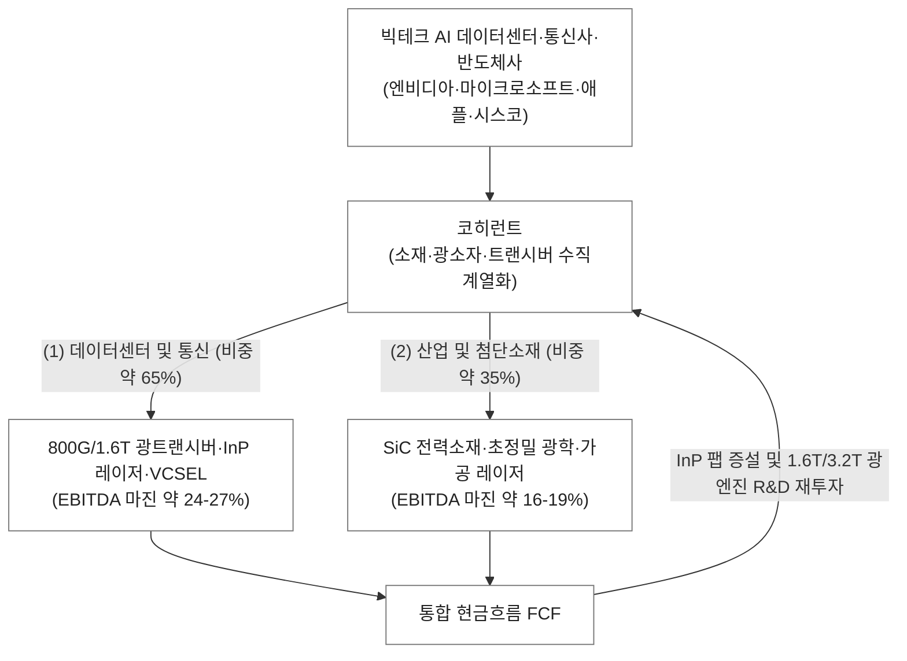

Coherent Corp. (COHR) | SEC Form 10-K (2025-08-20 공시) & Form 10-Q (2026-05-09 공시)

▌ 01. 실물 및 개념 앵커
- 한 줄 비유: 원자재(소재)부터 초미세 레이저 칩, 완성형 광모듈까지 수직계열화한 AI 고속도로의 글로벌 광자 제조 공장.
- 물리적 실체: 6인치 인듐인화물(InP) 및 갈륨비소(GaAs) 웨이퍼에서 생산되는 나노미터급 반도체 레이저 칩(VCSEL/EML), 탄화규소(SiC) 기판, 그리고 이를 정밀 패키징한 800G/1.6T OSFP/QSFP-DD 규격의 금속 외장 광트랜시버 모듈.

▌ 02. 비즈니스 모델 및 사업 믹스 (SEC 공시 기준)
- 과금 방식: AI 클러스터용 광트랜시버 완제품 및 광소자, 반도체 가공용 레이저 장비, 화합물 반도체 소재를 하이퍼스케일러 및 글로벌 IT/자동차 제조사에 직납(B2B Hardware & Materials).
- 엔진 1 (주력/초고성장): 데이터센터 및 통신 (800G/1.6T 광트랜시버, VCSEL/EML 레이저 다이오드, 통신망 광증폭기 및 수동소자) · 연간 매출 약 42억-48억 달러 (비중 약 65-70%) · EBITDA 마진 약 24-27% (엔비디아향 800G/1.6T 다년 공급 계약 기반 고속 성장).
- 엔진 2 (캐시카우/소재 확장): 산업 및 첨단소재 (전력반도체용 SiC 웨이퍼, 정밀 광학 부품, 첨단 디스플레이/반도체 공정용 레이저 시스템) · 연간 매출 약 20억-22억 달러 (비중 약 30-35%) · EBITDA 마진 약 16-19%.

▌ 03. 밸류체인 위치 및 락인
- 밸류체인 칸: 【소재(InP/GaAs/SiC) ➔ 광소자(VCSEL/EML) ➔ 완제품(광트랜시버) 수직통합 티어-1】
- 고객 및 쏠림: 엔비디아(NVIDIA), 마이크로소프트, 아마존(AWS), 애플, 시스코 등 · 엔비디아 및 대형 클라우드 3사 비중 약 40-50% 점유.
- 경쟁 및 락인: 루멘텀(Lumentum), 이노라이트(Innolight), 브로드컴(Broadcom)과 경쟁 · 락인: 자체 InP/GaAs 웨이퍼 팹(텍사스 셔먼 팹 등)을 보유하여 광소자 칩부터 트랜시버 모듈까지 원스톱으로 양산 공급할 수 있는 독보적 수직계열화 원가 경쟁력과 엔비디아 슈퍼팟(SuperPOD) 레퍼런스 인증.

▌ 04. 원가 및 이익 구조
- 마진 구조: Gross Margin 약 36-39% (Non-GAAP 기준 40-42%) · OPM 약 12-15% · EBITDA Margin 약 21-25%
- 핵심 이익 원천: 엔비디아 및 하이퍼스케일러향 800G/1.6T 고속 광트랜시버의 대량 출하와 자체 생산 레이저 칩 내재화에 따른 마진 스프레드.
- 주요 비용 계정: 웨이퍼 팹 유지 및 가동 감가상각비, 차세대 1.6T/3.2T 및 CPO(공패키징 광학) 선행 R&D 비용, 생산 라인 증설에 따른 고정 설비비.

▌ 05. 회계 특이사항 및 퀄리티 (10-K 스캔)
- SBC 및 희석 위험: 매출 대비 SBC 비중 약 5-7% 수준으로 통제 · 과거 II-VI와 구 Coherent 대규모 합병으로 인한 영업권 및 무형자산 상각비가 GAAP 순이익을 압박하나 현금 창출력은 견고.
- 현금흐름 퀄리티: 순이익 대비 영업현금흐름(CFO) 창출력 우수 · 신임 CEO(Jim Anderson) 취임 이후 비핵심 자산 정리 및 운전자본 회전율 개선 가속화.
- 이연매출 및 수주: AI 인프라향 1.6T 트랜시버 다년 장기 공급 계약 수주 잔고 급증으로 중장기 매출 시인성 확보.
- 특이 회계 리스크: 과거 산업용 레이저 부문의 경기 순환성 영업권 손상 리스크가 존재했으나, 데이터센터 매출 비중이 70%에 육박하며 포트폴리오 체질 개선 완료.

▌ 06. 핵심 3대 드라이버 (P·Q·C 축)
- P축 (단가/믹스): 400G에서 800G 및 1.6T 광트랜시버로의 ASP 믹스 개선 · 실리콘 포토닉스용 고출력 CW 레이저 및 초고속 InP EML 칩 공급 단가 프리미엄.
- Q축 (수량/침투): 차세대 AI GPU 랙(Blackwell 등)에서 구리선(DAC)의 물리적 한계로 인한 광트랜시버 채택률(Attach Rate)의 폭발적 증가.
- C축 (원가/레버리지): 자체 InP 팹 가동률 극대화에 따른 단위당 칩 생산 고정비 급감 및 모듈 패키징 공정 자동화를 통한 수율 개선.

▌ 07. 주요 경쟁사 지형도 (SEC 10-K 공시 명시)
- 데이터센터 광트랜시버 및 소자: Lumentum (InP 광소자 및 트랜시버 양대 산맥), Innolight (글로벌 1위권 트랜시버 물량 경쟁사), Broadcom (통합 광소자 및 DSP 칩셋 공급자)
- 탄화규소(SiC) 소재: Wolfspeed, STMicroelectronics, Onsemi
- 산업용 레이저 및 광학계: IPG Photonics, Trumpf, MKS Instruments

(출처: Coherent SEC Form 10-K [2025-08-20 공시] 및 Form 10-Q [2026-05-09 공시] MD&A)
