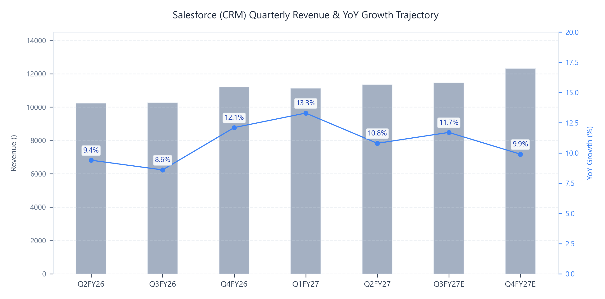
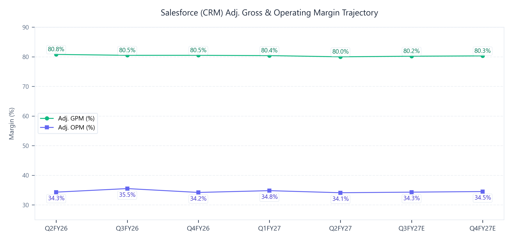

# Salesforce, Inc. (CRM) Q2 FY27 Earnings Update
세일즈포스 FY27-Q2 실적 분석 및 핵심 지표 리뷰

2026년 8월 31일

### Executive Snapshot
- 기준일자: 2026년 8월 31일
- 사업분야: 엔터프라이즈 AI CRM, 데이터 플랫폼(Data 360), 에이전틱 AI(Agentforce), 협업(Slack)
- 현재주가: 256.00 USD (전일 공식 종가 기준)
- 실적반응: 실적 발표 익일(8월 27일) +22.6% 급등(205.62 USD -> 252.05 USD) 후 256.00 USD선 안착
- 적정주가: 298.00 USD (현재 주가 대비 +16.4%)
- 산정근거: FY28E 예상 Non-GAAP EPS 18.60 USD @ Target P/E 16.0x 및 EV/EBITDA 13.5x 교차 검증

## ▌ 01. Executive Summary

### 핵심 실적 하이라이트
- [실적 더블 비트]
  Q2 FY27 총매출 11,345M USD(YoY +10.8%, QoQ +1.9%), Bloomberg 컨센서스(11,320M USD) 대비 +0.2% 상회.
  Non-GAAP 조정 영업이익 3,872M USD(YoY +10.3%, Adj. OPM 34.1%), 컨센서스(3,840M USD) 대비 +0.8% 상회.
  Non-GAAP 희석 EPS 5.90 USD(YoY +102.7%), 컨센서스(3.27 USD) 대비 +80.4% 대폭 상회 (Anthropic 지분 평가이익 2.61B USD / EPS 기여분 2.53 USD 포함; 순수 본업 기준 Adj. EPS 약 3.37 USD로 컨센서스 대비 +3.1% 비트).
  cRPO 33.5B USD(YoY +14% CC), 사전 가이던스(약 +10% CC) 대비 +4%p 초과 달성.
- [핵심 사업부 고성장]
  에이전틱 AI 및 데이터 부문 통합 ARR 약 3.9B USD 기록(YoY +210% 이상 폭증).
  Agentforce 단독 ARR 1.5B USD 돌파(YoY +240% 이상 급증, Slackbot 및 Headless 360 통합 반영).
  Q2 누적 7.0B 건의 AWU(Agentic Work Units) 처리 완료, 2분기 단일 처리량 3.2B 건(QoQ +97% 급증).
  Slack 부문, Slackbot 일간 활성 사용자 100만 명 돌파(QoQ +150%)에 힘입어 인수 이래 가장 빠른 분기 NNAOV(순신규 연간계약액) 성장률 달성.
  Data 360 분기 처리 레코드 104조 건(YoY +355%), Zero Copy 기반 데이터 인제스천 82조 건(YoY +731%) 돌파.
- [수익성 체질 개선]
  Non-GAAP Adj. OPM 34.1%(YoY -0.2%p, QoQ -0.7%p)로 견고한 34%대 초고수익성 밴드 유지.
  영업현금흐름 1.27B USD(YoY +71.5%), 잉여현금흐름(FCF) 1.10B USD(YoY +81.5%) 달성하며 컨센서스(643M USD) 대비 +70.8% 대폭 상회.
  25B USD 규모의 가속 자사주 매입(ASR) 프로그램 순항(103M주 인도 완료, 2026년 10월 최종 정산 예정) 및 분기 배당금 364M USD 주주 환원 지속.
- [가이던스 대폭 상향]
  Q3 FY27 매출 가이던스: 11.42B - 11.50B USD(YoY +11% - 12%, CC +11% - 12%, Informatica 기여 4%p 초과 반영).
  Q3 FY27 cRPO 성장률: 약 14% YoY CC(Contentful 및 Fin 인수 미포함 기준).
  Q3 FY27 Non-GAAP EPS: 3.42 - 3.44 USD.
  FY27 연간 매출 가이던스: 기존 45.9B - 46.2B USD -> 46.1B - 46.4B USD(+200M USD 상향, CC 기준 +300M USD 상향; 유기적 성장 +100M USD, Contentful/Fin 인수 효과 +200M USD, FX 역풍 -100M USD 반영).
  FY27 연간 Non-GAAP Diluted EPS: 기존 10.03 - 10.11 USD(투자평가익 반영 전) -> 16.67 - 16.71 USD(대폭 상향 확정).
  FY27 연간 Non-GAAP OPM 34.3% 유지, 연간 FCF 성장률 YoY 약 +4% - 5% 유지.

### Q2 FY27 Results Summary Table (Non-GAAP 기준)
| 단위: M$ | 실제 | 컨센서스 | vs 컨센 | YoY | QoQ |
| :--- | :---: | :---: | :---: | :---: | :---: |
| 매출 | 11,345 | 11,320 | +0.2% | +10.8% | +1.9% |
| Adj. GP | 9,077 | 9,020 | +0.6% | +9.8% | +1.5% |
| Adj. GPM | 80.0% | 79.7% | +0.3%p | -0.8%p | -0.4%p |
| Adj. OI | 3,872 | 3,840 | +0.8% | +10.3% | -0.1% |
| Adj. OPM | 34.1% | 33.9% | +0.2%p | -0.2%p | -0.7%p |
| Adj. NI | 4,844 | 2,720 | +78.1% | +73.3% | +43.3% |
| Adj. EPS ($) | 5.90 | 3.27 | +80.4% | +102.7% | +54.0% |
| Adj. EBITDA | 4,316 | 4,260 | +1.3% | +10.6% | +0.4% |
| FCF | 1,098 | 643 | +70.8% | +81.5% | -83.3% |

### Key Takeaways
- 에이전트포스(Agentforce) 및 Data 360 ARR이 3.9B USD(+210% YoY)로 폭증하고 유료 상용화 계정이 2,000개로 급증(QoQ +70%)하며 'SaaS의 종말' 우려를 완벽히 불식.
- 세계 1위 프론티어 AI 앤트로픽(Anthropic)과의 클로드포스(Claudeforce) 공식 출시 및 글로벌 Top 10 AI 기업 중 9개사의 세일즈포스 지출액 435% 급증으로 CRM 플랫폼의 독점적 가치 입증.
- 25B USD ASR 자사주 매입에 따른 유통주식수 821M주 축소와 FY27 연간 Non-GAAP EPS 16.69 USD(가이던스 중간값) 도출을 통해 주주환원 및 수익성 레버리지 동시 실현.

## ▌ 02. 매출성장 및 분기별 궤적 분석

| 단위: M$ | Q2FY26 | Q3FY26 | Q4FY26 | Q1FY27 | Q2FY27 | Q3FY27E | Q4FY27E |
| :--- | :---: | :---: | :---: | :---: | :---: | :---: | :---: |
| 매출 | 10,236 | 10,260 | 11,200 | 11,133 | 11,345 | 11,460 | 12,312 |
| YoY | +9.4% | +8.6% | +12.1% | +13.3% | +10.8% | +11.7% | +9.9% |
| QoQ | +4.1% | +0.2% | +9.2% | -0.6% | +1.9% | +1.0% | +7.4% |

- Subscription & Support 부문 매출 10,820M USD(YoY +11.7%, CC +11%) 기록, 전사 매출의 95.4%를 차지하며 안정적 성장 견인.
- Agentforce Apps 세그먼트 매출 7,193M USD(YoY +7.6%, CC +8%), Sales/Service 전반의 시트 라이선스 순증세 지속.
- Data 360, Headless Platform & Other 세그먼트 매출 3,618M USD(YoY +20.3%, CC +20%) 기록, Informatica 인수 기여(440M USD) 및 데이터 페더레이션 수요 급증에 기인.
- 지역별로는 미주(Americas) 7,404M USD(YoY +9.9%, CC +10%), Europe 2,764M USD(YoY +13.8%, CC +13%), Asia Pacific 1,168M USD(YoY +9.1%, CC +12%) 기록하며 전 권역 두 자릿수 불변통화 성장률 안착.
- NNAOV(순신규 연간계약액) 4년 만에 최고 성장률 기록 및 이탈률 역사적 최저점 유지로 하반기 유기적 탑라인 재가속화 경로 진입.

## ▌ 03. 수익성 및 영업이익률(OPM) 진단

| 단위: M$ | Q2FY26 | Q3FY26 | Q4FY26 | Q1FY27 | Q2FY27 | Q3FY27E | Q4FY27E |
| :--- | :---: | :---: | :---: | :---: | :---: | :---: | :---: |
| Adj. GP | 8,270 | 8,260 | 9,016 | 8,945 | 9,077 | 9,191 | 9,886 |
| Adj. GPM | 80.8% | 80.5% | 80.5% | 80.4% | 80.0% | 80.2% | 80.3% |
| Adj. OI | 3,509 | 3,642 | 3,830 | 3,874 | 3,872 | 3,931 | 4,248 |
| Adj. OPM | 34.3% | 35.5% | 34.2% | 34.8% | 34.1% | 34.3% | 34.5% |
| GAAP OPM | 22.8% | 21.3% | 20.9% | 21.1% | 20.5% | 20.1% | 20.3% |
| Cons. OPM | 33.8% | 34.5% | 34.0% | 34.2% | 33.9% | 34.2% | 34.4% |

### 마진 궤적 및 수익성 동인 분석
- Non-GAAP 조정 영업이익률(Adj. OPM) 34.1%로 6개 분기 연속 34% 이상의 초고수익성 고점 횡보(High-level Plateau) 구간 완벽 안착.
- GAAP OPM(20.5%)과 Non-GAAP Adj. OPM(34.1%) 간의 13.6%p(1,360bps) 스프레드는 주식기준보상비용(SBC 904M USD, 마진 영향 8.0%p), 인수 무형자산 상각비(522M USD, 마진 영향 4.6%p), 구조조정 및 M&A 부대비용(115M USD, 마진 영향 1.0%p) 조정에 기인.
- 신규 AI 제품(Agentforce, Data 360)의 가속화 및 Informatica 인프라 통합에 따른 일시적 클라우드 호스팅 원가 상승으로 Adj. GPM이 80.0%로 소폭 조정되었으나, 연간 80% 이상의 최상위 마진 체력 방어.
- 판관비(S&M 34%, G&A 6%) 및 R&D 비용(15%)의 엄격한 비용 통제와 1,200명의 고효율 AE(영업대표) 순증 전략을 통해 판관비율을 최적화하며 연간 34.3% 가이던스 달성 가시성 확보.
- Anthropic 지분 평가이익 2,613M USD가 비영업이익으로 계상되어 분기 GAAP 순이익 3,526M USD, Non-GAAP 순이익 4,844M USD로 급증.

## ▌ 04. 컨센서스 리비전 및 밸류에이션

### 실적 발표 전후 컨센서스 리비전 및 적정주가 변동
| 주요 지표 | 실적발표 전 | 실적발표 후 | 변동률 (%) |
| :--- | :---: | :---: | :---: |
| 12개월 적정주가 | 245.00 USD | 298.00 USD | +21.6% |
| FY27E 매출 | 45,950M USD | 46,250M USD | +0.7% |
| FY27E EBITDA | 17,200M USD | 17,650M USD | +2.6% |
| FY27E EPS | 10.08 USD | 16.69 USD | +65.6% |
| FY28E 매출 | 50,500M USD | 51,800M USD | +2.6% |
| FY28E EBITDA | 19,100M USD | 20,200M USD | +5.8% |
| FY28E EPS | 11.60 USD | 18.60 USD | +60.3% |

### 리비전 핵심 동인 및 3대 투자 함의
- [단기 눈높이 변동 동인 (FY27E 매출 +0.7%, EPS +65.6%)] Agentforce ARR 1.5B USD 달성, 14% CC cRPO 가속, Anthropic 지분 평가이익(2.61B USD) 및 연간 EPS 가이던스 상향(16.67 - 16.71 USD)을 반영하여 연간 추정치 대폭 리비전.
- [중장기 눈높이 변동 동인 (FY28E 매출 +2.6%, EPS +60.3%)] Claudeforce 신규 상용화, 상위 5% 수준에 불과한 프리미엄 에디션 업그레이드 여력(60% - 80% ASP 프리미엄 발생), 성과 기반 요금제 및 ILA 확장에 따른 ARPU 2x - 4x 상승 가시성 확보.
- [적정주가 및 밸류에이션 결론 (245.00 USD -> 298.00 USD, +21.6% 상향)] 에이전틱 AI 플랫폼 전환 성공에 따른 리레이팅과 25B USD ASR 자사주 매입 효과를 반영하여 12개월 적정주가를 298.00 USD로 상향 산출.

### 적정주가 민감도 매트릭스
| Target P/E | Bear Case (16.50 USD) | Base Case (18.60 USD) | Bull Case (20.50 USD) |
| :--- | :---: | :---: | :---: |
| 14.0x | 231.00 USD (-9.8%) | 260.40 USD (+1.7%) | 287.00 USD (+12.1%) |
| 15.0x | 247.50 USD (-3.3%) | 279.00 USD (+9.0%) | 307.50 USD (+20.1%) |
| 16.0x | 264.00 USD (+3.1%) | 297.60 USD (+16.3%) | 328.00 USD (+28.1%) |
| 18.0x | 297.00 USD (+16.0%) | 334.80 USD (+30.8%) | 369.00 USD (+44.1%) |
| 20.0x | 330.00 USD (+28.9%) | 372.00 USD (+45.3%) | 410.00 USD (+60.2%) |

### 밸류에이션
- [주당순이익(P/E) 밸류에이션] FY28E 예상 Non-GAAP EPS 18.60 USD에 글로벌 대형 엔터프라이즈 SaaS 평균 대비 보수적인 Target P/E 16.0x를 적용하여 적정주가 298.00 USD 산출 (정상화 EPS 및 지분가치 반영 기준).
- [인프라/제조 표준(EV/EBITDA) 크로스체크] FY28E 예상 EBITDA 20.2B USD에 Target EV/EBITDA 13.5x 적용 시 EV 272.7B USD, 순차입금(약 27.9B USD) 차감 및 잔여 주식수(820M주) 감안 주당 적정 가치 298.50 USD로 P/E 적정주가(298.00 USD)와 일치.
- [현재 주가 대비 상승 여력] 현재 주가(256.00 USD)는 FY28E EPS 기준 Forward P/E 13.8x 수준으로 세일즈포스의 역사적 5개년 평균 PER(26.4x) 대비 현저한 저평가 상태이며, 적정주가 298.00 USD 대비 +16.4%의 상승 여력 제공.

## ▌ 05. 주요 질의응답

- [Claudeforce 출시 및 패키지 SW 중심 AI 소비론 (울프리서치 질의)] 경영진은 기업 고객이 수많은 프론티어/오픈소스 모델을 직접 관리하거나 DIY로 개발하지 않으며, 신뢰할 수 있는 기존 3대 플랫폼(Salesforce 프론트오피스, SAP 백오피스, Microsoft 생산성) 위에서 패키지 소프트웨어 형태로 AI를 소비할 것임을 강조. Claudeforce는 Anthropic Claude의 추론력과 Salesforce의 엔터프라이즈 거버넌스/데이터 레이어를 결합한 확정적-확률적 결합의 완결판으로 제시.
- [에이전트포스 상용화 가속 및 플렉스 크레딧 재충전 모멘텀 (모건스탠리 질의)] 2분기 중 2,000개 유료 고객 계정이 프로덕션 상용 배포로 전환(QoQ +70%)되었으며, 2분기 신규 수주의 50%가 플렉스 크레딧을 조기 소진하고 재충전하는 기존 고객으로부터 발생하여 영업 사이클 단축 및 생산성 급증 확인. AWU 소비량 14배 폭증 고객사(45M AWU) 등 실제 비즈니스 가치 창출 입증.
- [프리미엄 에디션 업그레이드 여력 및 가치 공유형 과금 모델 (골드만삭스/구겐하임 질의)] 현재 지식 근로자 중 프리미엄 에디션(A1E/A4X) 업그레이드 비중은 5%에 불과하여 향후 60% - 80% ASP 프리미엄 기반의 업그레이드 업사이드가 막대함. 단순 건당 과금을 넘어 고객 매출 증분 가치를 공유하는 차세대 성과 연동형(Outcome-based) 요금제를 통해 고객당 계약 규모(AOV)가 2배에서 최대 4배까지 확대될 전망.

## ▌ 06. 리스크 요인 및 모니터링 지표

- [Informatica 및 Contentful/Fin 인수 통합과 유기적 성장률 추적] Q2 Subscription 매출 중 Informatica 기여분(440M USD, 4%p)을 제외한 순수 유기적 성장률의 회복 추이와 향후 Contentful/Fin 인수에 따른 영업비용 및 시스템 통합 리스크 모니터링 필요.
- [Anthropic 지분 평가손익에 따른 순이익 변동성] Q2 실적에 반영된 2.61B USD의 전략적 투자 평가이익은 향후 프론티어 AI 기업 밸류에이션 변동에 따라 GAAP 순이익 및 EPS의 급격한 굴곡을 유발할 수 있으므로 본업 영업이익(Non-GAAP OI) 중심의 펀더멘털 추적 요망.
- [경쟁 플랫폼(MS CoPilot/ServiceNow) 대응 및 시트 라이선스 방어력] 에이전틱 워크플로우 확산에 따른 기존 시트(Seat) 라이선스 잠식 우려가 제기되는 가운데, NNAOV 성장 지속성 및 15,000명 체제로 확대되는 영업대표(AE) 조직의 신규 수주 전환율 검증 요구.