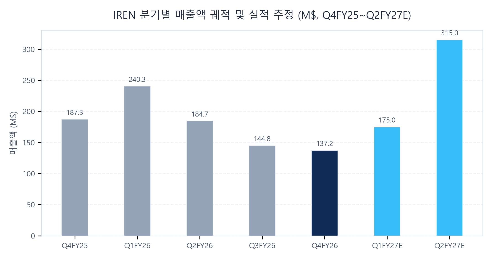
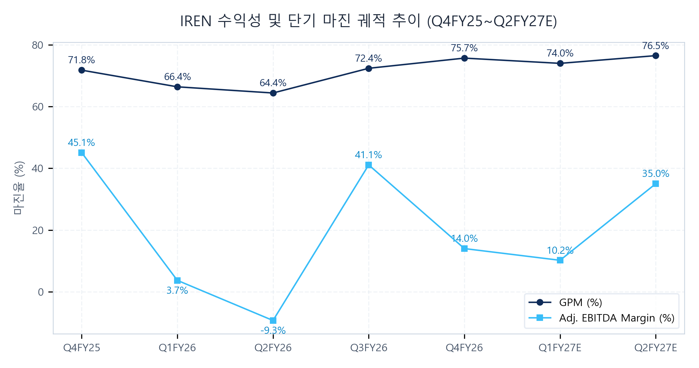

# IREN (IREN) Q4 FY26 Earnings Update
2026년 8월 28일

### Executive Snapshot
- 기준일자: 2026년 8월 28일
- 사업분야: 차세대 AI 클라우드 인프라 & 데이터센터 및 비트코인 채굴
- 현재주가: 40.53 USD (-8.2% 시간외 하락 37.19 USD)
- 적정주가: 71.00 USD (현재 주가 대비 +75.2%)
- 산정근거: FY28E 예상 EPS $2.84 @ Target P/E 25.0x 및 EV/EBITDA 14.0x 적용

## ▌ 01. Executive Summary

### 핵심 실적 하이라이트
- [실적 체질 전환 & 탑라인 미스] 매출액 137.2M USD (컨센서스 157.1M USD 대비 -12.7% 하회) vs Adj. EPS -0.41 USD (컨센서스 -0.45 USD 상회): 비트코인 채굴기 의도적 퇴역에 따른 채굴 매출 감소(66.7M USD) 대비 AI Cloud 부문(70.5M USD, QoQ +109.9%)의 역사적 첫 과반(51.4%) 점유에 기인.
- [초대형 CapEx 쇼크 & 주식 희석 공포] FY27 CapEx 가이던스 25.0B - 30.0B USD 제시로 시장 충격 발생: 기확보 자금 14.0B USD 및 추가 GPU 조달 8.0B USD를 감안해도 잔여 펀딩 갭이 존재하여 대규모 유상증자(Equity Offering) 및 전환사채 추가 발행에 따른 주주가치 희석 우려가 시간외 -8.2% 급락의 최대 트리거로 작용.
- [단기 판관비 급증 & 수익성 절벽 예고] Q1 FY27 현금 기준 SG&A 전분기 대비 +40M - 50M USD 급증 가이던스: AI 매출 본격화 전 선제적 인력 3배 확충 및 C레벨 5명 영입, 미란티스/노스트럼 통합 비용이 먼저 반영되며 단기 마진 압박 요인으로 부각.
- [가이던스 대폭 상향 & 매출 인식 시차] 2026년 Capa 계약 ARR 기존 2.5B USD 수준 -> 신규 확정 4.0B USD (+60.0% 상향, 완판 달성) 및 현재 가동 ARR 1.0B USD 락인: 다만 12월 분기 공급 용량의 회계적 매출 인식은 내년 3월 분기(Q3 FY27)부터 본격화되는 시차(Revenue Lag)가 공식 확인.

### Q4 FY26 Results Summary Table (Non-GAAP 기준)
| 단위: M$       |    실제    |   컨센서스   |  vs 컨센  |  YoY   |  QoQ   |
| :----------- | :------: | :------: | :-----: | :----: | :----: |
| 매출           |  137.2   |  157.1   | -12.7%  | -26.7% | -5.2%  |
| Adj. GP      |  103.9   |  110.0   |  -5.5%  | -22.7% | -1.0%  |
| Adj. GPM     |  75.7%   |  70.0%   | +5.7%p  | +3.9%p | +3.3%p |
| Adj. OI      |   3.8    |  -15.0   |   N/A   | -81.5% |  N/A   |
| Adj. OPM     |   2.8%   |  -9.5%   | +12.3%p | -8.2%p |  N/A   |
| Adj. EBITDA  |   19.2   |   22.5   | -14.7%  | -77.2% | -67.7% |
| Adj. NI      |  -72.9   |  -120.0  |   N/A   |  N/A   |  N/A   |
| Adj. EPS ($) |  -0.41   |  -0.45   |  +0.04  |  N/A   |  N/A   |
| FCF          | -2,911.9 | -2,500.0 |   N/A   |  N/A   |  N/A   |

### Key Takeaways
- 비트코인 채굴 중심에서 순수 AI 인프라 플랫폼으로의 체질 전환 완성 (AI Cloud 매출 비중 51.4% 돌파 및 2026년 12월 말 채굴 전면 중단 확정).
- 2026년 가용 용량 0.3GW(IT) 전량 완판 및 4.0B USD 확정 ARR 확보로 중장기 성장 활주로는 견고하나, 매출 인식의 회계적 반영은 2027년 3월 분기(Q3 FY27)로 이연.
- FY27 연간 25B-30B USD에 달하는 천문학적 CapEx 조달 과정에서의 단기 주식 희석(Dilution) 리스크와 비투자등급 고객 대상 9.0% 고금리 부채에 따른 이자비용 부담이 주가 단기 하방 압력으로 작용.

## ▌ 02. 매출성장 및 분기별 궤적 분석

| 단위: M$ | Q4FY25  | Q1FY26  | Q2FY26 | Q3FY26 | Q4FY26 | Q1FY27E | Q2FY27E |
| :----- | :-----: | :-----: | :----: | :----: | :----: | :-----: | :-----: |
| 매출     |  187.3  |  240.3  | 184.7  | 144.8  | 137.2  |  175.0  |  315.0  |
| YoY    | +226.3% | +355.4% | +59.0% | -0.0%  | -26.7% | -27.2%  | +70.5%  |
| QoQ    | +29.3%  | +28.3%  | -23.1% | -21.6% | -5.2%  | +27.6%  | +80.0%  |

### 세그먼트별 성장 동인 및 전환기 실적 공백 분석
- 비트코인 채굴 장비의 전략적 감축 및 퇴역으로 전사 매출 외형은 전년 동기 대비 -26.7% 역성장했으나, AI Cloud 매출은 Q3 33.6M USD에서 Q4 70.5M USD로 109.9% 폭증하며 채굴 매출(66.7M USD)을 사상 최초로 추월.
- 2026년 12월 말 비트코인 채굴 전면 중단 결정에 따라 기존 채굴 캐시카우 소멸과 AI Cloud 램프업 사이의 단기 외형 공백(Transition Valley) 발생.
- Microsoft 향 50MW 액체냉각 배치(Horizon 1) 인도 완료 후 Horizon 2~4(150MW)가 2026년 4분기 말 순차 가동될 예정이나, 경영진 가이던스대로 회계상 매출 반영은 2027년 3월 분기(Q3 FY27)부터 본격화되므로 Q1 FY27E 175.0M USD, Q2 FY27E 315.0M USD로 점진적 회복 후 Q3부터 폭발적 퀀텀점프 전개.

## ▌ 03. 수익성 및 영업이익률(OPM) 진단

| 단위: M$ | Q4FY25 | Q1FY26 | Q2FY26 | Q3FY26 | Q4FY26 | Q1FY27E | Q2FY27E |
| :--- | :---: | :---: | :---: | :---: | :---: | :---: | :---: |
| Adj. GP | 134.4 | 159.6 | 118.9 | 104.9 | 103.9 | 129.5 | 241.0 |
| Adj. GPM | 71.8% | 66.4% | 64.4% | 72.4% | 75.7% | 74.0% | 76.5% |
| Adj. OI | 20.6 | 12.8 | -8.5 | 5.2 | 3.8 | -15.0 | 45.0 |
| Adj. OPM | 11.0% | 5.3% | -4.6% | 3.6% | 2.8% | -8.6% | 14.3% |
| GAAP OPM | 11.0% | -31.8% | -63.0% | -161.3% | -452.1% | -12.0% | 10.0% |
| Cons. OPM | 12.5% | 8.0% | -2.0% | -5.0% | -9.5% | 5.0% | 18.0% |

### 마진 궤적 및 단기 수익성 압박 요인 분석
- Q4 FY26 GAAP OPM(-452.1%)과 Adj. OPM(2.8%) 간의 대규모 괴리는 AI 전환에 수반된 3대 일회성 비현금성 항목에 기인: (1) 구형 채굴기 일괄 감액 손상 450.4M USD (마진 영향 -328.2%p), (2) 매각예정자산 공정가치 평가손 102.1M USD 및 처분손 25.1M USD (마진 영향 -92.7%p), (3) SBC 및 M&A 부대비용 52.6M USD (마진 영향 -38.3%p).
- 단기적으로 Q1 FY27에 현금 판관비가 +40M - 50M USD 급증하여 약 170M-180M USD에 육박할 것으로 예고됨에 따라 Q1 FY27 Adj. OPM은 일시적으로 적자(-8.6%) 전환 불가피.
- 4.0B USD 확정 ARR이 재무제표에 본격 계상되는 Q3 FY27 이후부터는 저원가 전력망 경쟁력과 고정비 레버리지 효과가 극대화되며 분기 OPM 30~40%대로 급격한 체질 개선 달성 전망.

## ▌ 04. 컨센서스 리비전 및 밸류에이션

### 실적 발표 전후 컨센서스 리비전 및 적정주가 변동
| 주요 지표 | 실적발표 전 | 실적발표 후 | 변동률 (%) |
| :--- | :---: | :---: | :---: |
| 12개월 적정주가 | $75.00 | $71.00 | -5.3% |
| FY27E 매출 | $2,980M | $2,150M | -27.9% |
| FY27E EBITDA | $2,100M | $1,450M | -31.0% |
| FY27E EPS | $1.62 | $0.98 | -39.5% |
| FY28E 매출 | $6,400M | $5,200M | -18.8% |
| FY28E EBITDA | $3,100M | $2,750M | -11.3% |
| FY28E EPS | $3.55 | $2.84 | -20.0% |

### 리비전 핵심 동인 및 3대 투자 함의
- [FY27 단기 눈높이 대폭 하향 (매출 -27.9%, EPS -39.5%)] 40억 달러 ARR 완판 달성에도 불구하고, 12월 분기 공급 용량의 회계적 매출 인식이 내년 3월 분기(Q3 FY27)로 이연되는 매출 시차(Revenue Lag)와 Q1 FY27 현금 판관비 급증(+40M - 50M USD)을 반영하여 단기 이익 눈높이 하향 조정.
- [FY28 중장기 눈높이 완만한 조정 (EBITDA -11.3%, EPS -20.0%)] 250억 - 300억 달러 CapEx 집행에 수반되는 추가 주식 발행(희석) 및 9% 고금리 부채에 따른 금융비용을 반영하여 중장기 EPS 눈높이를 $3.55에서 $2.84로 현실화.
- [적정주가 및 밸류에이션 결론 ($75.00 -> $71.00, -5.3%)] 단기 이익 추정치 하향에도 불구하고 2026년 가용 용량 완판과 장기 전력 파이프라인의 실물 펀더멘털은 견고하여 적정주가 조정폭(-5.3%)은 제한적이며, 현재 주가(40.53 USD, 시간외 37.19 USD) 대비 +75.2%의 상승 여력 보유.

### 적정주가 민감도 매트릭스
| Target P/E | Bear Case ($2.20) | Base Case ($2.84) | Bull Case ($3.50) |
| :--- | :---: | :---: | :---: |
| 18.0x | $39.60 (-2.3%) | $51.12 (+26.1%) | $63.00 (+55.4%) |
| 22.0x | $48.40 (+19.4%) | $62.48 (+54.2%) | $77.00 (+90.0%) |
| 25.0x | $55.00 (+35.7%) | $71.00 (+75.2%) | $87.50 (+115.9%) |
| 28.0x | $61.60 (+52.0%) | $79.52 (+96.2%) | $98.00 (+141.8%) |
| 32.0x | $70.40 (+73.7%) | $90.88 (+124.2%) | $112.00 (+176.3%) |

### 밸류에이션
- [주당순이익(P/E) 밸류에이션] FY28E 예상 EPS 2.84 USD에 글로벌 AI 인프라 피어 타깃 배수 25.0x를 적용하여 적정주가 71.00 USD 산출.
- [인프라 표준(EV/EBITDA) 크로스체크] FY28E EBITDA 2,750M USD에 데이터센터 인프라 타깃 EV/EBITDA 14.0x 적용 시 EV 38.5B USD, 예상 순차입금 6.5B USD 차감 후 주당 적정 가치는 71.11 USD로 P/E 적정주가와 동일한 71 USD 선에 완벽 수렴.
- [현재 주가 대비 상승 여력] 현재 주가(40.53 USD, 시간외 37.19 USD) 대비 +75.2% (시간외 기준 +90.9%)의 상승 여력을 제공하며, 단기 비용 선반영 및 매출 인식 시차에 따른 주가 조정은 중장기 완판 ARR 40억 달러 가치 대비 과도한 낙폭으로 판단.

## ▌ 05. 주요 질의응답

- [FY27 CapEx 25B-30B USD 가이던스 및 자금 조달 방안 (골드만삭스 질의)] 앤서니 CFO는 25B-30B USD CapEx가 FY27 마이크로소프트 잔여분과 2027년 공랭식/액체냉각 배치를 포괄한다고 설명. 기확보 14.0B USD 외에 GPU 파이낸싱 8.0B USD를 추가 조달하고 무담보 상태인 데이터센터 자산 기반 금융을 적극 활용할 계획이나, 시장에서는 여전히 유상증자 등 에쿼티 조달 가능성에 무게를 둠.
- [MW당 계약 단가 20M-25M USD 상승 및 고객 선수금 구조 (캔터 피츠제럴드 질의)] 켄트 CCO는 최근 체결된 3-5년 계약 기준 MW당 연간 매출이 >20M USD 수준이며 신규 협상가는 ~25M USD/MW에 달한다고 강조. 고객사가 GPU CapEx의 45-55%를 선수금으로 지급하여 실제 데이터센터 건설 비용의 100%를 선제 충당하는 자금 플라이휠이 작동 중임을 확인.
- [텍사스 애벗 주지사 행정명령 및 전력망 연계 규제 영향 (B. 라일리 질의)] 켄트 CCO는 칠드레스 등 텍사스 부지는 전력망 업그레이드 비용을 자체 부담했고 폐쇄 루프 수랭으로 용수 소비가 거의 없어 주지사의 규제 방향과 완벽히 일치한다고 설명. 이미 전력이 완전 공급된 대규모 사이트 2곳을 보유한 IREN이 오히려 인허가 강화의 반사이익을 얻을 것으로 답변.

## ▌ 06. 리스크 요인 및 모니터링 지표

- 25B-30B USD에 달하는 대규모 CapEx 집행에 따른 주식 희석(Equity Dilution) 및 전환사채 추가 발행 가능성.
- 비투자등급 고객사 대상 9.0% 고정금리 GPU 파이낸싱 및 총 7.6B USD 부채에 수반되는 분기별 금융비용 부담.
- Horizon 2-4(150MW) 가동 지연 리스크 및 2026년 12월 비트코인 채굴 전면 중단에 따른 단기 현금흐름 둔화.
