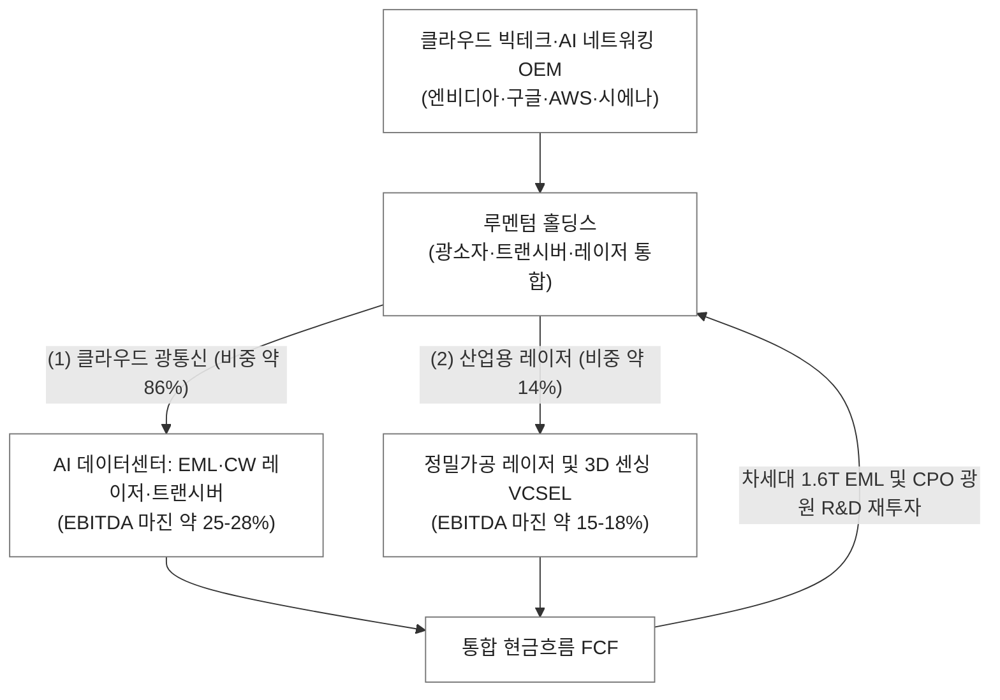

Lumentum Holdings Inc. (LITE) | SEC Form 10-K (2025-08-22 공시) & Form 10-Q (2026-05-08 공시)

▌ 01. 실물 및 개념 앵커
- 한 줄 비유: 구리선의 한계를 넘어 테라비트급 전기 신호를 빛(광자)으로 변환해 쏘아주는 AI 데이터센터의 초고속 광학 심장.
- 물리적 실체: 손톱보다 작은 인듐인화물(InP) 기반 레이저 다이오드 칩(EML/CW 레이저) 및 이를 내장한 손가락 크기의 800G/1.6T 광트랜시버 모듈. AI GPU 클러스터 간 스위치 백본 및 통신사 전송망 광케이블에 직접 결합되어 피코초 단위로 고출력 레이저 펄스를 방출.

▌ 02. 비즈니스 모델 및 사업 믹스 (SEC 공시 기준)
- 과금 방식: AI 서버/스위치용 광트랜시버 완제품 및 광소자(EML, CW 레이저, ROADM)를 하이퍼스케일러 및 네트워크 장비사/광모듈사에 부품/모듈 단위로 판매(B2B Hardware).
- 엔진 1 (주력/초고성장): 클라우드 및 네트워킹 (800G/1.6T 광트랜시버, EML 광원, CPO용 초고출력 CW 레이저, 통신용 ROADM) · 연간 매출 약 14.1억 달러 (비중 약 86%) · EBITDA 마진 약 25-28% (클라우드라이트 인수로 AI 트랜시버 직공급 체제 구축).
- 엔진 2 (캐시카우/안정): 산업용 기술 (반도체/디스플레이 미세가공용 초단펄스 산업용 레이저, 모바일/전장 3D 센싱용 VCSEL 모듈) · 연간 매출 약 2.3억 달러 (비중 약 14%) · EBITDA 마진 약 15-18%.

▌ 03. 밸류체인 위치 및 락인
- 밸류체인 칸: 【AI 데이터센터 광통신 핵심 광원 소자 및 광트랜시버 (전송 티어-1)】
- 고객 및 쏠림: 엔비디아(NVIDIA), 구글, 아마존(AWS), 마이크로소프트, 시스코, 시에나 · 상위 고객사(엔비디아 및 통신 장비 탑 고객) 매출 비중 약 50% 수준 집중.
- 경쟁 및 락인: 코히런트(Coherent), 이노라이트(Innolight), 브로드컴(Broadcom)과 과점 경쟁 · 락인: InP 인듐인화물 자체 웨이퍼 팹(내재화 파운드리) 기반의 고수율 EML/CW 레이저 설계 역량과 엔비디아 AI 클러스터 전용 트랜시버 벤더 인증 락인.

▌ 04. 원가 및 이익 구조
- 마진 구조: Gross Margin 약 34-38% (Non-GAAP 기준 40-42%) · OPM 약 12-16% · EBITDA Margin 약 22-26%
- 핵심 이익 원천: 800G 및 1.6T 세대교체에 따른 고마진 EML 광원 및 고출력 CW(연속파) 레이저 공급 단가 프리미엄.
- 주요 비용 계정: InP 웨이퍼 팹 감가상각비, 실리콘 포토닉스/CPO 선행 연구개발비(R&D 비중 약 18-20%), 광학 패키징 및 수작업 조립 외주 가공비.

▌ 05. 회계 특이사항 및 퀄리티 (10-K 스캔)
- SBC 및 희석 위험: 매출 대비 SBC 비중 약 7-9% 수준 · 클라우드라이트(Cloud Light) 및 네오포토닉스(NeoPhotonics) 인수 관련 무형자산 상각비로 인한 GAAP 순이익 착시(Non-GAAP 조정 갭 상존).
- 현금흐름 퀄리티: 순이익 대비 영업현금흐름(CFO) 양호하게 회복 중 · AI 광트랜시버 수요 폭증에 따른 원재료(InP 웨이퍼 및 광학 렌즈) 재고자산 관리 주기 정상화.
- 이연매출 및 수주: 하이퍼스케일러 및 AI 서버 OEM향 중장기 NCNR(취소불가) 장기 공급 확약 수주 기반으로 3-4개 분기 매출 가시성 확보.
- 특이 회계 리스크: 과거 구형 통신 장비(텔레콤) 수요 둔화 시 발생했던 재고평가손실 리스크가 AI 데이터컴 믹스 확대로 대폭 완화.

▌ 06. 핵심 3대 드라이버 (P·Q·C 축)
- P축 (단가/믹스): 400G에서 800G 및 1.6T 광트랜시버로의 세대교체에 따른 대당 ASP 상승 · 실리콘 포토닉스 외장 광원(ELSFP/CW 레이저) 탑재로 광소자 부가가치 급증.
- Q축 (수량/침투): 차세대 Blackwell 및 루빈 AI GPU 클러스터 스케일아웃에 따른 GPU당 광트랜시버/광원 부착 개수(Attach Rate) 폭증.
- C축 (원가/레버리지): 자체 InP 팹 가동률 상승에 따른 고정비 분산 및 태국/동남아 모듈 조립 라인 자동화를 통한 제조 원가 절감.

▌ 07. 주요 경쟁사 지형도 (SEC 10-K 공시 명시)
- 데이터컴 광트랜시버 및 광소자: Coherent (InP/GaAs 기반 광소자 및 트랜시버 최대 라이벌), Innolight (중국계 트랜시버 강자), Broadcom (광소자 및 실리콘 포토닉스/DSP 경쟁)
- 광통신 네트워크 부품(ROADM/증폭기): Coherent, Acacia (Cisco 자회사)
- 산업용 레이저: IPG Photonics, Coherent, Trumpf

(출처: Lumentum SEC Form 10-K [2025-08-22 공시] 및 Form 10-Q [2026-05-08 공시] MD&A)
