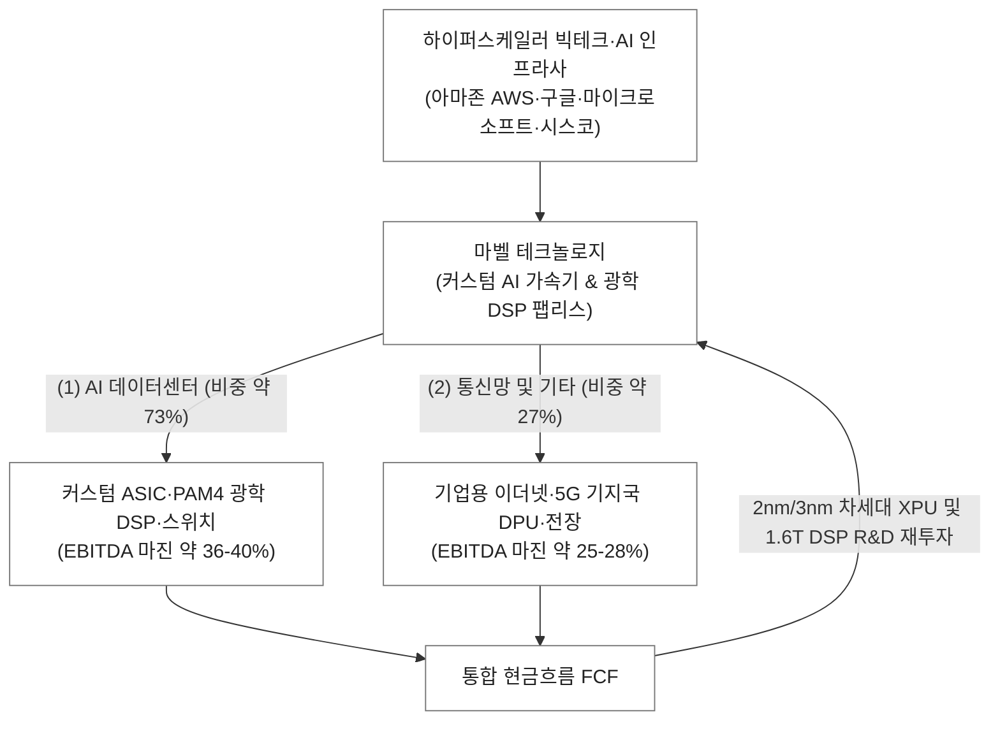

Marvell Technology, Inc. (MRVL) | SEC Form 10-K (2026-03-11 공시) & Form 10-Q (2026-06-05 공시)

▌ 01. 실물 및 개념 앵커
- 한 줄 비유: 빅테크 자체 AI 칩(ASIC)을 대신 설계해주고, 수만 개의 AI GPU를 광속으로 이어주는 AI 인프라의 맞춤형 반도체 아키텍트.
- 물리적 실체: 첨단 3nm/5nm 공정에서 제조되는 고성능 시스템 반도체(SoC). AI 연산을 전담하는 초대형 커스텀 AI 가속기 칩(XPU) 및 광트랜시버 내부에서 800G/1.6T 전기 신호를 정밀 복원하는 초소형 PAM4 광학 DSP 칩(Nova/Spica), PCIe/CXL 리타이머 칩.

▌ 02. 비즈니스 모델 및 사업 믹스 (SEC 공시 기준)
- 과금 방식: 하이퍼스케일러 맞춤형 AI ASIC NRE(초기 연구개발비) 수취 및 양산 칩셋 납품(Silicon Volume), 표준형 광학 DSP/이더넷 스위치 칩셋 판매(Fabless Semiconductor).
- 엔진 1 (주력/초고성장): 데이터센터 (커스텀 AI 가속기 ASIC, 800G/1.6T 광학 PAM4 DSP, Teralynx 클라우드 이더넷 스위치, DCI COLORZ ZR 광모듈) · 연간 매출 약 60억 달러 (비중 약 73%) · EBITDA 마진 약 36-40% (아마존 Trainium/Inferentia 및 구글 Axion 등 빅테크 커스텀 칩 양산 본격화).
- 엔진 2 (캐시카우/안정 회복): 통신망 및 기타 (기업용 스위칭/라우팅 Prestera 칩셋, 5G 캐리어 기지국용 OCTEON DPU/베이스밴드, 차량용 이더넷 반도체) · 연간 매출 약 22억 달러 (비중 약 27%) · EBITDA 마진 약 25-28%.

▌ 03. 밸류체인 위치 및 락인
- 밸류체인 칸: 【AI 데이터센터 핵심 팹리스 반도체 (커스텀 ASIC & 광학 DSP 듀얼 강자)】
- 고객 및 쏠림: 아마존(AWS), 구글(Alphabet), 마이크로소프트, 메타, 시스코 · 상위 2대 고객(아마존, 구글 등 하이퍼스케일러) 매출 비중 약 30-40% 이상 집중.
- 경쟁 및 락인: 브로드컴(Broadcom), 크레도(Credo), 아스테라랩스(Astera Labs)와 경쟁 · 락인: TSMC 최첨단 선단 공정(3nm/2nm) 및 2.5D/3D 패키징 IP, 224G SerDes 고속 인터페이스 특허 라이브러리, 그리고 빅테크 자체 AI 모델 아키텍처에 완벽 최적화된 맞춤형 커스텀 실리콘 락인.

▌ 04. 원가 및 이익 구조
- 마진 구조: Gross Margin 약 52-54% (Non-GAAP 기준 60-63%) · OPM 약 16-20% (Non-GAAP 32-35%) · EBITDA Margin 약 33-36%
- 핵심 이익 원천: 광트랜시버 시장을 지배하는 800G/1.6T 광학 DSP의 높은 단가 및 마진 + 빅테크 커스텀 AI 가속기 대량 양산에 따른 폭발적인 볼륨 레버리지.
- 주요 비용 계정: TSMC 웨이퍼 파운드리 및 첨단 패키징(CoWoS) 매입 원가, 2nm 차세대 칩 선행 개발을 위한 대규모 R&D 비용(매출의 약 28-32%), 마스크(Mask) 제작비.

▌ 05. 회계 특이사항 및 퀄리티 (10-K 스캔)
- SBC 및 희석 위험: 매출 대비 SBC 비중 약 10-12%로 반도체 팹리스 특성상 다소 높음 · 과거 인파이(Inphi), 카비움(Cavium), 아베라(Avera) 등 대규모 M&A에 따른 무형자산 상각비로 GAAP 당기순이익이 억눌리나 FCF 창출력은 극히 양호.
- 현금흐름 퀄리티: Non-GAAP 영업이익 기준 연간 25억 달러 이상의 강력한 잉여현금흐름(FCF) 창출 · 대형 고객사 선단 공정 테이프아웃 선수금 기반 운전자본 방어.
- 이연매출 및 수주: 하이퍼스케일러 커스텀 ASIC 프로젝트의 다년 계약 체결로 2-3년 이상의 확정적인 양산 매출 파이프라인 락인.
- 특이 회계 리스크: 과거 구형 5G 통신망 및 엔터프라이즈 재고 조정으로 발생했던 일회성 감손 리스크가 종료되고 AI 데이터센터 중심 포트폴리오로 완전 재편.

▌ 06. 핵심 3대 드라이버 (P·Q·C 축)
- P축 (단가/믹스): 800G에서 1.6T 광학 DSP(Nova)로의 전환에 따른 칩당 ASP 상승 · 단순 인터커넥트 칩 대비 수십 배 고가인 초대형 다이 커스텀 AI XPU 칩셋 공급.
- Q축 (수량/침투): 빅테크들의 엔비디아 GPU 의존도 탈피 및 자체 AI 가속기(AWS Trainium, MS Maia 등) 대량 배치 확대 · AI 클러스터 규모 확장에 따른 노드 간 광학 DSP 소요량 급증.
- C축 (원가/레버리지): 커스텀 칩 양산 물량 확대에 따른 마스크 제작 및 선행 R&D 고정비 희석(영업 레버리지 본격화).

▌ 07. 주요 경쟁사 지형도 (SEC 10-K 공시 명시)
- 커스텀 AI 가속기 ASIC: Broadcom (구글 TPU/메타 ASIC 선점 1위사), Alchip, VeriSilicon
- 광학 DSP 및 인터커넥트: Broadcom (광학 DSP 최대 경쟁사), Credo Technology (AEC/DSP 경쟁), MaxLinear
- PCIe/CXL 리타이머: Astera Labs (PCIe 리타이머 1위 경쟁), Parade Technologies

(출처: Marvell SEC Form 10-K [2026-03-11 공시] 및 Form 10-Q [2026-06-05 공시] MD&A)
