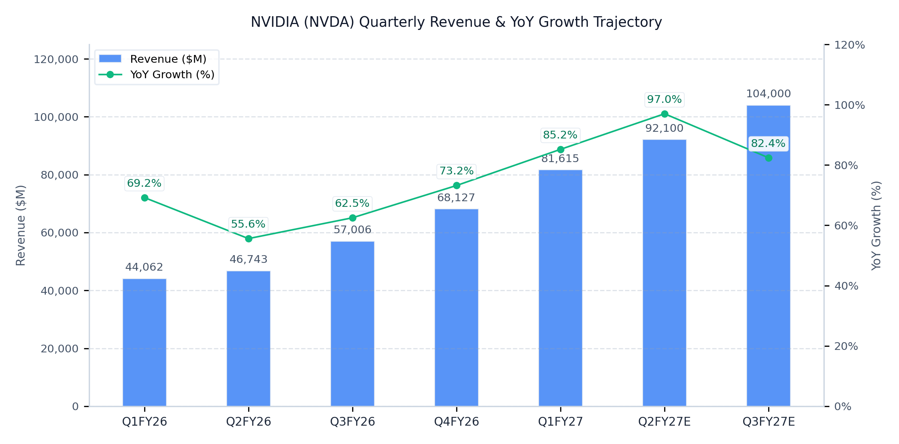
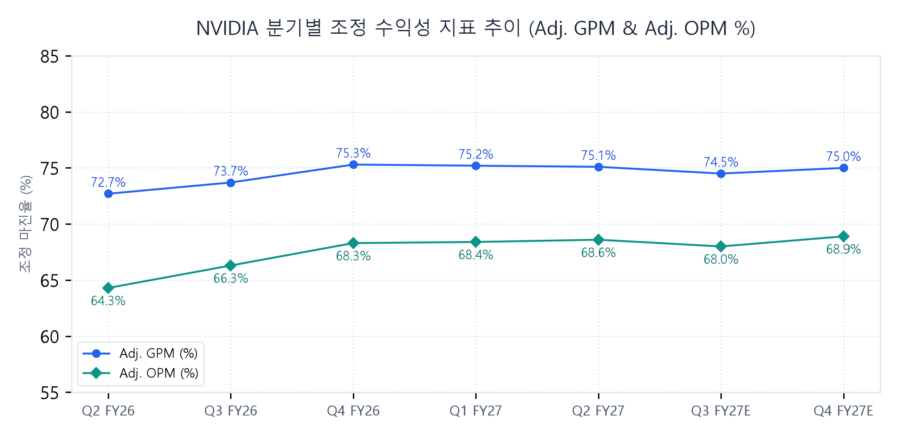

# NVIDIA Corporation (NVDA) Q2 FY27 Earnings Update
2026년 8월 27일

### Executive Snapshot
- 기준일자: 2026년 8월 27일
- 사업분야: AI 가속 컴퓨팅 및 데이터센터 GPU/네트워킹 풀스택 인프라
- 현재주가: 209.66 USD (-1.6% 하락)
- 적정주가: 352.22 USD (현재 주가 대비 +68.0%)
- 산정근거: FY28E 예상 EPS $16.01 @ Target P/E 22.0x 및 EV/EBITDA 18.5x 적용

## ▌ 01. Executive Summary

### 핵심 실적 하이라이트
- [실적 더블 비트]
  Q2 FY27 총매출 96,221M USD(YoY +105.9%, QoQ +17.9%), 컨센서스(92,000M USD) 대비 +4.6% 상회.
  Non-GAAP 조정 영업이익 65,983M USD(YoY +119.5%, OPM 68.6%), 컨센서스(61,000M USD) 대비 +8.2% 상회.
  Non-GAAP 희석 EPS 2.22 USD(YoY +105.6%), 컨센서스(2.09 USD) 대비 +6.2% 상회하며 분기 사상 최대 실적 경신.
- [핵심 사업부 고성장]
  Data Center 부문 매출 89,023M USD(YoY +116.6%, QoQ +18.3%) 기록, 전체 매출 비중 92.5% 차지.
  Hyperscale 부문 매출 48,710M USD(YoY +101.5%), ACIE(AI 클라우드/엔터프라이즈/소버린) 부문 매출 40,313M USD(YoY +138.1%, QoQ +25.2%) 기록.
- [수익성 체질 개선]
  Blackwell Ultra 시스템 믹스 개선 및 수율 안정화로 Adj. GPM 75.1%(YoY +2.4%p), Adj. OPM 68.6%(YoY +4.3%p) 달성.
  자체 파운데이션 모델 R&D 인프라 투자 확대에도 전사적인 풀스택 하드웨어/소프트웨어 레버리지 효과로 영업이익 65.98B USD 창출.
- [가이던스 대폭 상향]
  Q3 FY27 매출 가이던스: 사전 컨센서스 104,000M USD -> 108,000M USD(±2%, +3.8% / +4,000M USD 상향).
  Q3 FY27 Adj. GPM: 사전 기대치 75.0% -> 74.0%(±50bps, 메모리 원가 부담 반영 -100bps 조정), Non-GAAP OpEx 약 9,000M USD(Adj. OI 약 70.92B USD 내재) 제시.
  FY28 연간 매출 전망: 기존 월가 뷰 약 548,500M USD(YoY +35 - 40%) -> YoY 약 +70% 초고성장(약 690,771M USD, +142B USD 이상 대폭 상향 공식화).
  차세대 Vera Rubin 아키텍처 Q3 양산 출하 개시 및 공급망 확보 약정액: 직전 분기 119B USD -> 279B USD(+160B USD / +134% 급증).

### Q2 FY27 Results Summary Table (Non-GAAP / Adj. 기준)
| 단위: M$       |   실제   |  컨센서스  | vs 컨센  |   YoY   |  QoQ   |
| :----------- | :----: | :----: | :----: | :-----: | :----: |
| 매출           | 96,221 | 92,000 | +4.6%  | +105.9% | +17.9% |
| Adj. GP      | 72,213 | 68,450 | +5.5%  | +112.4% | +17.7% |
| Adj. GPM     | 75.1%  | 74.4%  | +0.7%p | +2.4%p  | -0.1%p |
| Adj. OI      | 65,983 | 61,000 | +8.2%  | +119.5% | +18.2% |
| Adj. OPM     | 68.6%  | 66.3%  | +2.3%p | +4.3%p  | +0.2%p |
| Adj. NI      | 54,180 | 50,800 | +6.7%  | +104.2% | +11.8% |
| Adj. EPS ($) |  2.22  |  2.09  | +6.2%  | +105.6% | +12.1% |
| Adj. EBITDA  | 67,000 | 62,200 | +7.7%  | +117.8% | +18.1% |
| FCF          | 36,500 | 33,000 | +10.6% | +118.6% | +8.9%  |

### Key Takeaways
- Blackwell Ultra 랙 스케일 풀스택 시스템(NVL72) 글로벌 본격 납품에 따른 데이터센터 탑라인 가속화 및 조정 영업이익률 68.6% 달성.
- 차세대 Vera Rubin 아키텍처 Q3 FY27 양산 출하 개시와 공급망 확보 약정 279B USD(전분기 119B USD 대비 +134%) 급증으로 중장기 실적 가시성 완벽 확보.
- 경영진의 FY28 연간 매출 YoY 약 +70% 공식 가이던스 제시(순수 수요는 2배 수준이나 공급 제약 반영) 및 기가와트당 TAM 40B USD 확대에 따른 초장기 성장 동력 확보.

## ▌ 02. 매출성장 및 분기별 궤적 분석

| 단위: M$ | Q2FY26 | Q3FY26 | Q4FY26 | Q1FY27 | Q2FY27 | Q3FY27E | Q4FY27E |
| :--- | :---: | :---: | :---: | :---: | :---: | :---: | :---: |
| 매출 | 46,743 | 57,006 | 68,127 | 81,615 | 96,221 | 108,000 | 120,500 |
| YoY | +55.6% | +62.5% | +73.2% | +85.2% | +105.9% | +89.5% | +76.9% |
| QoQ | +6.1% | +22.0% | +19.5% | +19.8% | +17.9% | +12.2% | +11.6% |

- Blackwell Ultra 랙 스케일 아키텍처의 글로벌 하이퍼스케일러 및 네오클라우드向 본격 양산 납품에 기인.
- Hyperscale 부문 매출 48,710M USD(YoY +101.5%, QoQ +13.1%)로 견고한 성장세 지속.
- ACIE(AI Clouds, Industrial, & Enterprise) 부문 매출 40,313M USD(YoY +138.1%, QoQ +25.2%) 기록하며 전사 외형 성장의 핵심 모멘텀으로 안착.
- Edge Computing 부문 매출 7,198M USD(YoY +27.5%, QoQ +13.0%) 기록, Blackwell 워크스테이션 판매 호조가 메모리 가격 상승에 따른 컨슈머 PC 둔화를 효과적으로 방어.
- 중국향 데이터센터 출하는 대미 수출통제 영향으로 전사 데이터센터 매출의 1% 미만으로 축소되며 향후 가이던스 및 추정 모델에서 완전히 배제되어 지정학적 실적 훼손 리스크 선제 차단.

## ▌ 03. 수익성 및 영업이익률(OPM) 진단

| 단위: M$ | Q2FY26 | Q3FY26 | Q4FY26 | Q1FY27 | Q2FY27 | Q3FY27E | Q4FY27E |
| :--- | :---: | :---: | :---: | :---: | :---: | :---: | :---: |
| Adj. GP | 33,995 | 42,000 | 51,300 | 61,350 | 72,213 | 79,920 | 86,158 |
| Adj. GPM | 72.7% | 73.7% | 75.3% | 75.2% | 75.1% | 74.0% | 71.5% |
| Adj. OI | 30,064 | 37,800 | 46,500 | 55,800 | 65,983 | 70,920 | 76,358 |
| Adj. OPM | 64.3% | 66.3% | 68.3% | 68.4% | 68.6% | 65.7% | 63.4% |
| GAAP OPM | 60.8% | 63.2% | 65.0% | 65.6% | 66.2% | 63.5% | 61.2% |
| Cons. OPM | 63.5% | 65.5% | 67.2% | 67.5% | 66.3% | 66.0% | 65.0% |

### 마진 궤적 및 수익성 동인 분석
- Non-GAAP 조정 영업이익률(Adj. OPM) 68.6%로 분기 사상 최고치를 경신하며 초고수익성 레인지(High-level Plateau) 확고히 안착.
- GAAP OPM(66.2%)과 Non-GAAP Adj. OPM(68.6%) 간의 2.4%p(240bps) 스프레드는 주식기준보상비용(SBC 약 1,850M USD) 및 인수관련 무형자산 상각비(약 433M USD) 조정에 기인하며, 매출총이익률(GPM) 차이는 약 20bps(GAAP 74.9% vs Non-GAAP 75.1%) 수준으로 제한적.
- Blackwell Ultra 믹스 고도화 및 CoWoS/선단 패키징 수율 최적화로 Q2 Adj. GPM 75.1% 견조하게 방어.
- 단기 마진 궤적은 메모리(HBM4/DRAM) 부품 원가 폭등에 따라 Q3FY27E GPM 74.0%, Q4FY27E GPM 71.5%로 일시적 저점(Trough)을 형성한 뒤, Q1 FY28 단행될 시스템 판가 인상 효력 발효로 FY28 연간 72%~73% 수준에 재안착할 것으로 전망.
- 자체 AI 파운데이션 모델(Nemotron, Cosmos, GR00T) 개발에 따른 컴퓨트 인프라 R&D 비용(YoY +127%) 급증에도 불구하고, 압도적인 시스템 납품 증가로 판관비율을 슬림화하여 연간 OPM 65%~66%대의 초고수익성 레버리지 유지.

## ▌ 04. 컨센서스 리비전 및 밸류에이션

### 실적 발표 전후 컨센서스 리비전 및 적정주가 변동
| 주요 지표        |  실적발표 전   |  실적발표 후   | 변동률 (%) |
| :----------- | :-------: | :-------: | :-----: |
| 12개월 적정주가    |  285.00 USD  |  352.22 USD  | +23.6%  |
| FY27E 매출     | 385,000M USD | 406,336M USD |  +5.5%  |
| FY27E EBITDA | 255,000M USD | 274,500M USD |  +7.6%  |
| FY27E EPS    |   9.15 USD   |   9.71 USD   |  +6.1%  |
| FY28E 매출     | 548,500M USD | 690,771M USD | +25.9%  |
| FY28E EBITDA | 365,000M USD | 463,500M USD | +27.0%  |
| FY28E EPS    |  12.80 USD   |  16.01 USD   | +25.1%  |

### 리비전 핵심 동인 및 3대 투자 함의
- [FY27 단기 눈높이 상향 (매출 +5.5%, EPS +6.1%)] Blackwell Ultra 랙 스케일(NVL72) 풀스택 인프라 출하 가속화 및 Hyperscale/ACIE 전방위 수요 폭증을 반영하여 단기 외형 및 주당순이익 눈높이 상향 조정.
- [FY28 중장기 눈높이 대폭 상향 (매출 +25.9%, EPS +25.1%)] 차세대 Vera Rubin 아키텍처 양산 개시, 공급망 확보 약정액 279B USD(+134%) 급증, 경영진의 연간 매출 YoY +70% 공식 가이던스 반영에 따라 FY28E EPS를 12.80 USD에서 16.01 USD로 대폭 상향.
- [적정주가 및 밸류에이션 결론 (285.00 USD -> 352.22, USD +23.6%)] 중장기 실적 가시성 대폭 확대 및 AI 가속 컴퓨팅 독점력 프리미엄을 반영하여 12개월 적정주가를 352.22 USD로 상향하며, 현재 주가(209.66 USD) 대비 +68.0%의 매력적인 상승 여력 보유.

### 적정주가 민감도 매트릭스
| Target P/E | Bear Case (14.40 USD) | Base Case (16.01 USD) | Bull Case (17.60 USD) |
| :--- | :---: | :---: | :---: |
| 18.0x | 259.20 USD (+23.6%) | 288.18 USD (+37.5%) | 316.80 USD (+51.1%) |
| 20.0x | 288.00 USD (+37.4%) | 320.20 USD (+52.7%) | 352.00 USD (+67.9%) |
| 22.0x | 316.80 USD (+51.1%) | 352.22 USD (+68.0%) | 387.20 USD (+84.7%) |
| 25.0x | 360.00 USD (+71.7%) | 400.25 USD (+90.9%) | 440.00 USD (+109.9%) |
| 28.0x | 403.20 USD (+92.3%) | 448.28 USD (+113.8%) | 492.80 USD (+135.0%) |

### 밸류에이션
- [주당순이익(P/E) 밸류에이션] FY28E 예상 EPS 16.01 USD에 글로벌 AI 가속 컴퓨팅 독점적 지배력 및 Vera Rubin 풀스택 턴키 프리미엄을 반영한 Target P/E 22.0x를 적용하여 적정주가 352.22 USD 산출 (공격적 Target P/E 25.0x 적용 시 400.25 USD).
- [인프라 표준(EV/EBITDA) 크로스체크] FY28E EBITDA 463.5B USD에 글로벌 선단 하드웨어 타깃 EV/EBITDA 18.5x 적용 시 EV 8.57T USD, 순현금 차감 후 주당 적정 가치는 354.10 USD로 P/E 적정주가(352.22 USD)와 완벽히 수렴.
- [현재 주가 대비 상승 여력] 현재 주가(209.66 USD)는 FY28E EPS 기준 Forward P/E 13.1x 수준으로 엔비디아의 역사적 5개년 평균 PER(38.5x) 대비 현저한 저평가 구간이며, 적정주가 352.22 USD 대비 +68.0%의 상승 여력 제공.

## ▌ 05. 주요 질의응답

- [FY28 70% 고성장 가이던스 및 공급망 제약 요인 (모건스탠리 질의)] 경영진은 FY28 매출 YoY 약 +70% 성장을 공식 가이던스로 제시. 고객사 순수 수요는 전년 대비 2배(+100%)에 달하나 공급망 제약(웨이퍼, CoWoS, HBM4, 전력/부지)을 보수적으로 반영하여 70%로 설정. 상류(메모리/파운드리) 및 하류(LPS/발전사) 전방위에 걸친 선제적 공급망 정렬을 통해 가시성 확보.
- [Vera Rubin 랙 스케일 아키텍처 및 기가와트당 TAM 40B USD 확대 (골드만삭스 질의)] 베라 루빈은 호퍼(18B USD/GW), 블랙웰(25B USD/GW) 대비 크게 확장된 기가와트당 40B USD의 매출 기회 창출. 에이전트 전용 Vera CPU 본격 양산으로 서버 CPU 시장 점유율을 확대하며 FY28 CPU 매출 2배 이상 성장 전망. Groq 3 LPX 랙 스케일 LPU 출하로 고대화성 초저지연 추론 시장까지 장악.
- [프론티어 AI 연구소 인프라 협력 및 대차대조표 활용 구조 (JP모건 질의)] SB Energy 파트너십을 통해 PORTS-Pike 4.25GW 부지 확보(OpenAI 대상 세대당 150만 개 GPU 수용 규모) 및 105B USD 신용보증 캡 설정. 글로벌 6대 자산운용사와 500B USD 펀딩 플랫폼을 구축하여 AI 연구소의 자본 제약을 해소하고 엔비디아 전용 인프라 수요 독점 플라이휠 가동.

## ▌ 06. 리스크 요인 및 모니터링 지표

- [메모리 부품 원가 급등에 따른 단기 GPM 저점 통과 추적] HBM 및 DRAM 공급 부족으로 인한 원가 상승 압력이 Q4 FY27 GPM을 71%~72% 저점으로 이끌 전망. Q1 FY28 단행될 시스템 판가 인상이 원가를 온전히 전가하며 FY28 연간 72%~73% 마진으로 정상화되는지 여부 모니터링 필요.
- [데이터센터 전력·부지(LPS) 병목 및 대규모 우발채무 리스크] SB Energy 및 프론티어 연구소 대상 105B USD 신용보증 및 36B USD 클라우드 서비스 약정 체결에 따라, 테넌트 완공 지연 또는 채무불이행 시 우발채무 현실화 여부 지속 추적 요망.
- [하이퍼스케일러 자체 실리콘(ASIC) 내재화 및 글로벌 반독점 조사] 빅테크의 자체 추론 칩 도입 가속화에 대응한 엔비디아 네트워킹(Quantum-X/Spectrum-X) 및 CUDA-X 소프트웨어 락인 지속성 검증과 각국 규제 당국의 GPU 공급 배분 심사 모니터링 요구.
