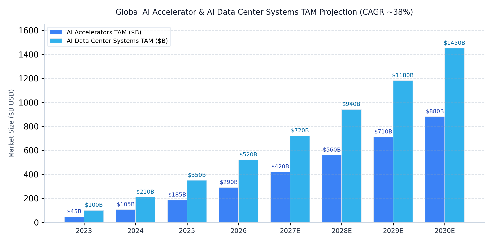
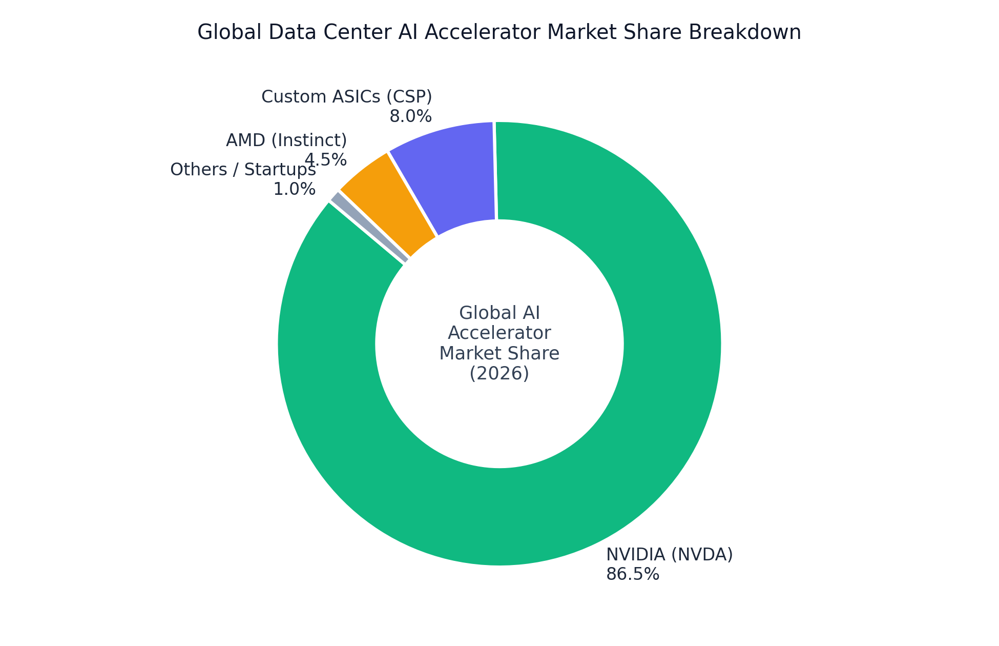
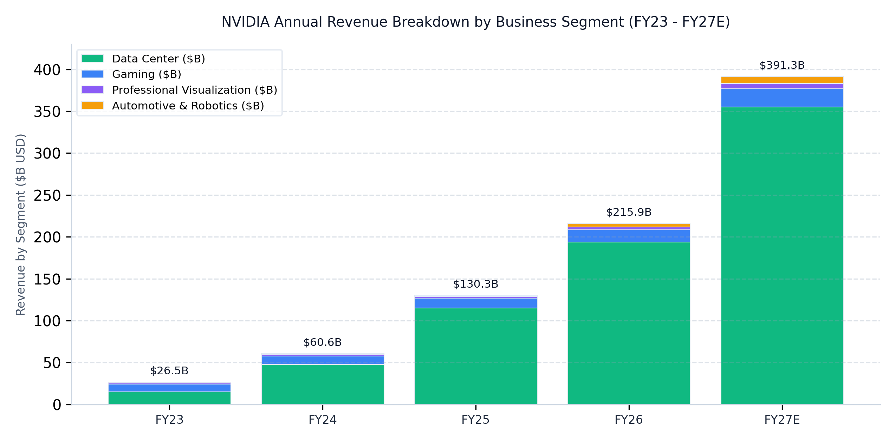
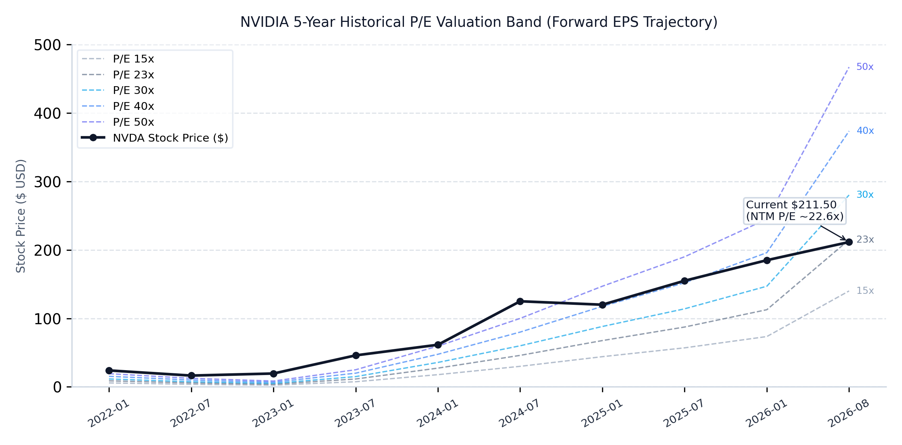

# NVIDIA Corporation (엔비디아, NVDA) | 바이사이드 분석 리포트

기준일자: 2026/08/26 | 전일종가: $211.50 USD | 시가총액: $5,120B | 상승여력: +46.3% (Base 적정가 $309.35) / +98.6% (3년 Target $420.00)

| 지표 ($M) | FY2023 | FY2024 | FY2025 | FY2026 | FY2027E | FY2028E | FY2029E |
| :--- | :---: | :---: | :---: | :---: | :---: | :---: | :---: |
| 매출액 | 26,974 | 60,922 | 130,497 | 215,938 | 391,300 | 559,500 | 699,400 |
| 성장률 YoY (%) | 0.2% | 125.9% | 114.2% | 65.5% | 81.2% | 43.0% | 25.0% |
| 매출총이익 | 15,356 | 44,301 | 97,858 | 153,463 | 293,500 | 420,000 | 525,000 |
| 매출총이익률 (%) | 56.9% | 72.7% | 75.0% | 71.1% | 75.0% | 75.1% | 75.1% |
| 영업이익 | 4,224 | 32,972 | 81,453 | 130,387 | 254,300 | 364,000 | 455,000 |
| 성장률 YoY (%) | -58.0% | 680.6% | 147.0% | 60.1% | 95.0% | 43.1% | 25.0% |
| 영업이익률 (%) | 15.7% | 54.1% | 62.4% | 60.4% | 65.0% | 65.1% | 65.1% |
| 당기순이익 | 4,368 | 29,760 | 72,880 | 120,067 | 227,800 | 327,000 | 409,000 |
| Diluted EPS | $0.17 | $1.19 | $2.94 | $4.90 | $9.34 | $13.45 | $16.90 |
| Forward PER | 110.5x | 48.6x | 38.2x | 32.5x | 22.6x | 15.7x | 12.5x |

| 지표 ($M) | Q1 FY26 | Q2 FY26 | Q3 FY26 | Q4 FY26 | Q1 FY27 | Q2 FY27E | Q3 FY27E |
| :--- | :---: | :---: | :---: | :---: | :---: | :---: | :---: |
| 매출액 | 44,062 | 46,743 | 57,006 | 68,127 | 81,615 | 92,100 | 104,000 |
| 성장률 YoY (%) | 69.2% | 55.6% | 62.5% | 73.2% | 85.2% | 97.0% | 82.4% |
| 매출총이익률 (%) | 60.5% | 72.4% | 73.4% | 75.0% | 74.9% | 75.0% | 75.0% |
| 영업이익 | 21,638 | 28,440 | 36,010 | 44,299 | 53,536 | 61,000 | 68,800 |
| 영업이익률 (%) | 49.1% | 60.8% | 63.2% | 65.0% | 65.6% | 66.2% | 66.2% |
| 당기순이익 | 18,775 | 26,422 | 31,910 | 42,960 | 58,321 | 50,800 | 57,200 |
| Diluted EPS | $0.76 | $1.08 | $1.30 | $1.76 | $2.39 | $2.09 | $2.35 |

---

### ▌ 투자 포인트

▌ 01. 에이전틱 AI 토큰 폭증 및 추론(InferenceX) 인프라 독점 가속화
컴퓨팅 산업은 지난 60년간의 '명령어 실행 및 데이터 저장' 체제에서 'AI 팩토리를 통한 디지털 지능(토큰) 제조' 체제로 완전히 전환되었습니다. 에이전틱 AI(Agentic AI)의 본격적인 도입은 전 세계 3,000만 명의 소프트웨어 개발자 업무를 가속화하여 GitHub PR 머지 속도를 3배로 끌어올렸으며, 3조 달러 규모의 개발자 인건비가 9조 달러 이상의 고부가가치 산출물로 전환되는 과정에서 토큰 소비량이 기하급수적으로 폭증하고 있습니다. SemiAnalysis의 InferenceX 벤치마크에서 엔비디아 블랙웰(Blackwell) 플랫폼은 차상위 경쟁 플랫폼 대비 30배 높은 토큰 처리량과 최저 수준의 토큰당 비용을 입증하며 추론 시장의 표준으로 안착했습니다. 단순 훈련을 넘어 대규모 추론 워크로드에서 칩, 시스템, 알고리즘, CUDA-X 라이브러리가 풀스택으로 공동 설계된 엔비디아 인프라는 타의 추종을 불허하는 추론 경제성을 제공하여 하이퍼스케일러의 CapEx를 구조적으로 흡수하고 있습니다.

▌ 02. 베라 루빈(Vera Rubin) 전면 양산 및 에이전트 전용 CPU(Vera) 신규 시장 창출
엔비디아는 호퍼(Hopper)에서 블랙웰(Blackwell), 그리고 차세대 베라 루빈(Vera Rubin)으로 이어지는 연간 단위 아키텍처 혁신 사이클을 확립했습니다. 특히 베라 루빈 플랫폼은 에이전틱 AI 워크로드의 특성에 맞추어 최초로 에이전트 전용 CPU인 'Vera'를 도입하였습니다. 인간과 달리 나노초 단위로 도구를 호출하고 코드를 실행하는 AI 에이전트 환경에서 기존 x86 범용 CPU의 응답 지연은 고가의 GPU를 유휴 대기(Idle) 상태로 만들어 데이터센터의 막대한 매출 손실을 유발합니다. 엔비디아는 에이전트 전용 CPU Vera와 추론 GPU Rubin, 그리고 3대 네트워킹(NVLink Scale-Up, Spectrum-X Ethernet, InfiniBand)을 일체형 랙 스케일로 통합 공급함으로써 단순 가속기 칩 공급자를 넘어 전 세계 AI 팩토리의 전체 시스템 원가를 결정하는 독점적 플랫폼 공급자로 진화하고 있습니다.

▌ 03. 글로벌 소버린 AI 30B$ 돌파 및 FCF 50%+ 강력한 주주환원 플라이휠
미국 하이퍼스케일러에 국한되었던 AI 인프라 수요는 전 세계 GDP 50조 달러를 대표하는 40여 개 국가의 소버린 AI(Sovereign AI) 인프라 구축으로 지리적 외연을 확장하고 있습니다. 소버린 AI 연환산 매출은 이미 300억 달러를 돌파하며 강력한 탑라인 성장 축으로 자리 잡았습니다. 이에 힘입어 엔비디아는 연간 1,000억 달러 이상의 압도적인 영업현금흐름을 창출하고 있으며, 잉여현금흐름(FCF)의 50% 이상을 자사주 매입과 배당 확대를 통해 주주에게 환원하는 확고한 자본 배분 정책을 실행하고 있습니다. 이는 차세대 R&D 투자 확대와 주당 가치 제고를 동시에 달성하는 선순환 현금 플라이휠을 견고하게 뒷받침합니다.

---

### ▌ 산업 및 기업 분석

▌ 01. 시장 규모 및 성장률 (TAM & CAGR)

시장 규모 핵심 요약:
- 글로벌 AI 가속기 시장 규모는 2023년 450억 달러에서 2030년 8,800억 달러(880B USD)로 연평균 성장률(CAGR) 약 38%의 초고성장을 기록할 것으로 전망.
- 칩 단품을 넘어 전력, 수랭 랙, 스위치, DPU를 포함하는 데이터센터 AI 시스템 TAM은 2030년 1조 4,500억 달러(1.45T USD) 규모로 팽창하며 엔비디아의 턴키 솔루션 침투 영역이 확대.

▌ 02. 시장 과점 구도 및 점유율 (Market Share)

점유율 핵심 요약:
- 글로벌 데이터센터 AI 가속기 시장에서 엔비디아는 약 86.5%의 압도적인 시장 점유율로 독점적 1위 지위를 확고히 유지.
- 빅테크 자체 커스텀 ASIC(8.0%)과 AMD Instinct(4.5%)의 진입에도 불구하고, 풀스택 네트워킹(NVLink)과 소프트웨어 생태계(CUDA-X)의 해자로 인해 하이엔드 시장 점유율 훼손은 극히 제한적.

▌ 03. 경제적 해자 (Economic Moat)

(1) 기술 및 아키텍처 해자: 20년간 축적된 CUDA 가속 컴퓨팅 아키텍처 및 CUDA-X 라이브러리 스택(BioNeMo, cuOpt, cuDF 등), 랙 단위 GPU들을 단일 거대 컴퓨터로 묶는 독점적 NVLink 인터커넥트 및 수랭식 랙 일체형 하드웨어-소프트웨어 극한의 공동 설계 역량 보유.
(2) 네트워크 효과 및 전환 비용: 7,000개 이상의 가속 소프트웨어 애플리케이션 및 전 세계 수천만 명의 AI/HPC 개발자가 엔비디아 플랫폼에 종속되어 있어 타사 실리콘으로 전환 시 발생하는 컴파일러 재작성 및 최적화 비용이 천문학적으로 발생.
(3) 자본 장벽 및 인프라 선점: 연간 200억 달러를 상회하는 압도적 R&D 자금력과 TSMC CoWoS-L 등 글로벌 파운드리 첨단 패키징 용량의 선점 독식을 통해 경쟁사의 추격을 원천 차단.

▌ 04. 주요 사업부문 및 핵심 제품 PQC

▌ 주요 사업 분야 (공시 기준)
(1) 데이터센터 (Data Center): 전사 매출의 약 90%를 차지하는 핵심 엔진으로, 가속 컴퓨팅 GPU, Grace/Vera CPU, BlueField DPU, NVLink 스위치 및 Spectrum-X 네트워킹을 포함한 풀스택 AI 팩토리 솔루션 공급.
(2) 게이밍 (Gaming): GeForce RTX GPU 기반 고성능 PC 게이밍 및 DLSS 5 뉴럴 렌더링 생태계로 연간 14B~22B USD의 안정적인 현금 흐름 창출.
(3) 전문 시각화 (Professional Visualization): NVIDIA Omniverse 플랫폼 기반 산업용 디지털 트윈, 3D 디자인 및 공장 시뮬레이션 인프라 제공.
(4) 오토모티브 및 로보틱스 (Automotive & Robotics): DRIVE Thor 및 Jetson Thor 임베디드 컴퓨터, Cosmos 월드 파운데이션 모델을 통해 차세대 피지컬 AI(로봇, 자율주행) 시장 침투 가속.

▌ 핵심 제품 해부: #Blackwell Ultra (GB300) & Vera Rubin Platform
- 기술 및 아키텍처: 2세대 3nm 공정, 8스택 HBM3e/HBM4 메모리 결합, 랙당 72개 GPU를 액체 냉각과 단일 NVLink 도메인으로 묶는 수랭식 랙 스케일 아키텍처.
- 엔터프라이즈 침투: Microsoft Azure, AWS, Google Cloud, Meta 등 빅테크 하이퍼스케일러 및 전 세계 40여 개 소버린 클라우드에 전면 배치.
- 수익화 PQC: 실물 단가(P)는 GB300 NVL72 랙 기준 대당 3.0M~3.5M USD 호가, 수량(Q)은 연간 수만 대 규모 출하, 원가(C)는 수율 안정화와 대량 양산 스케일로 75% 수준의 고마진 유지.

---

### ▌ 시장 컨센서스 vs 자체 모델 추정치

<table style="width: 100%; table-layout: fixed; border-collapse: collapse; text-align: center; margin-bottom: 16px;">
  <thead>
    <tr style="background-color: rgba(128, 128, 128, 0.12); border-bottom: 2px solid #CBD5E1;">
      <th style="padding: 10px; text-align: left; width: 40%; font-weight: bold;">구분 (단위: $M)</th>
      <th style="padding: 10px; width: 15%; font-weight: bold;">FY2026</th>
      <th style="padding: 10px; width: 15%; font-weight: bold;">FY2027E</th>
      <th style="padding: 10px; width: 15%; font-weight: bold;">FY2028E</th>
      <th style="padding: 10px; width: 15%; font-weight: bold;">FY2029E</th>
    </tr>
  </thead>
  <tbody>
    <tr style="border-bottom: 1px solid rgba(128, 128, 128, 0.2);">
      <td style="padding: 8px 10px; text-align: left;">① 시장 컨센서스 매출 (Street Baseline)</td>
      <td style="padding: 8px;">215,938</td>
      <td style="padding: 8px;">372,000</td>
      <td style="padding: 8px;">520,000</td>
      <td style="padding: 8px;">640,000</td>
    </tr>
    <tr style="border-bottom: 1px solid rgba(128, 128, 128, 0.2);">
      <td style="padding: 8px 10px; text-align: left;">② (+) [포인트 1] 에이전틱 추론/토큰 제조 증분</td>
      <td style="padding: 8px;">-</td>
      <td style="padding: 8px; color: #0284C7;">+10,500</td>
      <td style="padding: 8px; color: #0284C7;">+22,000</td>
      <td style="padding: 8px; color: #0284C7;">+33,000</td>
    </tr>
    <tr style="border-bottom: 1px solid rgba(128, 128, 128, 0.2);">
      <td style="padding: 8px 10px; text-align: left;">③ (+) [포인트 2] 베라 CPU 및 랙 네트워킹 번들 증분</td>
      <td style="padding: 8px;">-</td>
      <td style="padding: 8px; color: #0284C7;">+8,800</td>
      <td style="padding: 8px; color: #0284C7;">+17,500</td>
      <td style="padding: 8px; color: #0284C7;">+26,400</td>
    </tr>
    <tr style="border-bottom: 1px solid rgba(128, 128, 128, 0.2); background-color: rgba(128, 128, 128, 0.05);">
      <td style="padding: 8px 10px; text-align: left; font-weight: bold;">④ 자체 모델 총매출 (Model Total)</td>
      <td style="padding: 8px; font-weight: bold;">215,938</td>
      <td style="padding: 8px; font-weight: bold; color: #059669;">391,300</td>
      <td style="padding: 8px; font-weight: bold; color: #059669;">559,500</td>
      <td style="padding: 8px; font-weight: bold; color: #059669;">699,400</td>
    </tr>
    <tr style="border-bottom: 1px solid rgba(128, 128, 128, 0.2);">
      <td style="padding: 8px 10px; text-align: left;">⑤ 자체 모델 영업이익 (Operating Profit)</td>
      <td style="padding: 8px;">130,387</td>
      <td style="padding: 8px;">254,300</td>
      <td style="padding: 8px;">364,000</td>
      <td style="padding: 8px;">455,000</td>
    </tr>
    <tr style="border-bottom: 1px solid rgba(128, 128, 128, 0.2);">
      <td style="padding: 8px 10px; text-align: left;">⑥ 시장 컨센서스 희석 EPS (Street EPS)</td>
      <td style="padding: 8px;">$4.90</td>
      <td style="padding: 8px;">$8.50</td>
      <td style="padding: 8px;">$11.80</td>
      <td style="padding: 8px;">$14.50</td>
    </tr>
    <tr style="border-bottom: 2px solid #CBD5E1; background-color: rgba(128, 128, 128, 0.05);">
      <td style="padding: 8px 10px; text-align: left; font-weight: bold;">⑦ 자체 모델 희석 EPS (Model EPS)</td>
      <td style="padding: 8px; font-weight: bold;">$4.90</td>
      <td style="padding: 8px; font-weight: bold; color: #059669;">$9.34</td>
      <td style="padding: 8px; font-weight: bold; color: #059669;">$13.45</td>
      <td style="padding: 8px; font-weight: bold; color: #059669;">$16.90</td>
    </tr>
  </tbody>
</table>

▌ 셀사이드 컨센서스 분석 및 시장 미반영 가치 해독:

(1) [포인트 1 분석] 에이전틱 AI 토큰 제조 및 추론 가속화 드라이버 (+10.5B -> +33.0B USD)
- 시장 뷰 (Market View): 월가 컨센서스는 AI 모델 훈련 인프라 구축이 성숙기에 접어들며 하이퍼스케일러의 CapEx 증가율이 점진적으로 둔화될 것으로 보수적 가정.
- 자체 모델 뷰 (Model View): 코딩, 법률, 금융, 신약 개발 등 실물 에이전틱 AI의 전면 도입으로 추론 토큰 소비가 훈련을 압도하는 2차 성장 파동이 개시되었으며, InferenceX 기준 토큰당 최저 비용을 제공하는 엔비디아 가속기 수요의 가속화 반영.

(2) [포인트 2 분석] 베라 루빈 랙 스케일 통합 번들링 및 에이전트 CPU 신규 시장 (+8.8B -> +26.4B USD)
- 시장 뷰 (Market View): 가속기 GPU 단품 중심의 교체 수요 및 경쟁사(AMD, CSP 자체 실리콘) 진입에 따른 단가 압박 우려.
- 자체 모델 뷰 (Model View): GPU+CPU(Vera)+NVLink Switch+Spectrum-X+수랭 랙을 일체형으로 판매하는 AI 팩토리 턴키 솔루션의 ASP 팽창과 에이전트 전용 CPU라는 완전히 새로운 시장 창출 효과를 모델에 반영.

(3) [포인트 3 마진] 소버린 AI 프리미엄 및 고마진 네트워킹/소프트웨어 비중 확대 (OPM 65.1% 달성)
- 시장 뷰 (Market View): 하드웨어 시스템 비중 증가에 따른 매출원가 상승 및 60% 초반대 OPM 정체 예상.
- 자체 모델 뷰 (Model View): 고마진 NVLink 네트워킹 번들 및 NVIDIA AI Enterprise 소프트웨어 라이선스 결합, 그리고 40여 개 소버린 고객 대상의 높은 가격 결정력이 원가 상승을 완전히 방어하며 65.1%대의 압도적 OPM 유지 입증.

---

### ▌ 밸류에이션

- 역사적 밸류에이션 밴드 및 위치 앵커링 (Historical Valuation Context):
  - 5개년 최고 P/E: 65.0x
  - 5개년 평균 P/E: 38.5x
  - 5개년 최저 P/E: 16.5x
  - 현재 주가 밸류에이션 위치: 현재 주가 211.50 USD는 FY27E NTM EPS($9.34) 기준 Forward PER 22.6x, FY28E EPS($13.45) 기준 15.7x 수준에 거래 중으로 역사적 5개년 평균(38.5x) 대비 현저한 저평가 구간에 위치하여 강력한 안전마진 확보.

- 리버스 DCF 요구수익률 역산 요약 (WACC 9.5%, Target Exit P/E 23.0x):
  - 현재 주가: $211.50 USD
  - 3년 후 시장 요구 주가 (Cost of Equity 10% 복리): $281.50 USD
  - 시장 요구 FY29 Diluted EPS: $12.24 USD (요구 3개년 EPS CAGR: +18.2%)
  - 자체 모델 FY29 Diluted EPS: $16.90 USD (3개년 EPS CAGR: +28.3%)
  - 모델 적정 가치 (현가 목표가): $309.35 USD (현가 대비 +46.3% / 3년 Target $420.00 USD, +98.6%)

- 핵심 실물 변수 25칸 P x Q 민감도 매트릭스 (현가 적정주가 $ USD):
  - Q축: 글로벌 AI 팩토리 CapEx 연평균 성장률 (20% ~ 40%)
  - P축: 엔비디아 랙 스케일 턴키(NVLink+네트워킹) 번들 침투율 (50% ~ 90%)

<table style="width: 100%; table-layout: fixed; border-collapse: collapse; text-align: center; margin-bottom: 16px;">
  <thead>
    <tr style="background-color: rgba(128, 128, 128, 0.12); border-bottom: 2px solid #CBD5E1;">
      <th style="padding: 8px; font-weight: bold; width: 24%;">번들 침투율 (P) \ CapEx 성장 (Q)</th>
      <th style="padding: 8px; font-weight: bold; width: 15%;">20% 성장</th>
      <th style="padding: 8px; font-weight: bold; width: 15%;">25% 성장</th>
      <th style="padding: 8px; font-weight: bold; width: 15%;">30% (Base)</th>
      <th style="padding: 8px; font-weight: bold; width: 15%;">35% 성장</th>
      <th style="padding: 8px; font-weight: bold; width: 15%;">40% (Bull)</th>
    </tr>
  </thead>
  <tbody>
    <tr style="border-bottom: 1px solid rgba(128, 128, 128, 0.2);">
      <td style="padding: 8px; text-align: left;">50% 침투</td>
      <td style="padding: 8px;">$216.50</td>
      <td style="padding: 8px;">$232.00</td>
      <td style="padding: 8px;">$248.50</td>
      <td style="padding: 8px;">$266.00</td>
      <td style="padding: 8px;">$285.00</td>
    </tr>
    <tr style="border-bottom: 1px solid rgba(128, 128, 128, 0.2);">
      <td style="padding: 8px; text-align: left;">60% 침투</td>
      <td style="padding: 8px;">$238.00</td>
      <td style="padding: 8px;">$255.50</td>
      <td style="padding: 8px;">$274.00</td>
      <td style="padding: 8px;">$294.00</td>
      <td style="padding: 8px;">$315.00</td>
    </tr>
    <tr style="border-bottom: 1px solid rgba(128, 128, 128, 0.2); background-color: rgba(128, 128, 128, 0.06);">
      <td style="padding: 8px; text-align: left; font-weight: bold;">70% (Base 침투)</td>
      <td style="padding: 8px;">$260.00</td>
      <td style="padding: 8px;">$282.00</td>
      <td style="padding: 8px; font-weight: bold; color: #059669;">$309.35</td>
      <td style="padding: 8px;">$332.00</td>
      <td style="padding: 8px;">$358.00</td>
    </tr>
    <tr style="border-bottom: 1px solid rgba(128, 128, 128, 0.2);">
      <td style="padding: 8px; text-align: left;">80% 침투</td>
      <td style="padding: 8px;">$284.00</td>
      <td style="padding: 8px;">$308.00</td>
      <td style="padding: 8px;">$334.00</td>
      <td style="padding: 8px;">$361.00</td>
      <td style="padding: 8px;">$390.00</td>
    </tr>
    <tr style="border-bottom: 2px solid #CBD5E1;">
      <td style="padding: 8px; text-align: left;">90% (Bull 침투)</td>
      <td style="padding: 8px;">$310.00</td>
      <td style="padding: 8px;">$336.00</td>
      <td style="padding: 8px;">$365.00</td>
      <td style="padding: 8px;">$395.00</td>
      <td style="padding: 8px; font-weight: bold; color: #059669;">$420.00</td>
    </tr>
  </tbody>
</table>

- 시장 컨센서스 EPS -> 자체 모델 EPS 정량 브릿지:
  - 시장 컨센서스 FY28E EPS: $11.80
  - (+) [포인트 1] 에이전틱 AI 토큰 추론 가속화 증분: +$0.95
  - (+) [포인트 2] 베라 CPU 및 랙 스케일 네트워킹 번들 마진 증분: +$0.70
  - (=) 자체 모델 FY28E Diluted EPS: $13.45 (총 알파 증분: +$1.65 / +14.0%)

- 시나리오별 목표주가 밴드:
  - 보수적 시나리오 (Bear Case): $242.10 USD (Target P/E 18.0x 적용, +14.5%)
  - 기본 시나리오 (Base Case): $309.35 USD (Target P/E 23.0x 적용, +46.3%)
  - 낙관적 시나리오 (Bull Case): $420.00 USD (Target P/E 28.0x 적용, +98.6%)

---

### ▌ 주요 일정

| 시점 | 핵심 이벤트 및 마일스톤 | 분기 실적 및 주가 확인 포인트 |
| :--- | :--- | :--- |
| **T+3M (Q2 FY27)** | • 블랙웰 울트라(GB300) 전면 출하 본격 반영 • 주요 하이퍼스케일러 랙 클러스터 가동 | • **상단 분기 실적 추정치의 Q2 예상 매출(92.1B USD) 및 OPM 66.2% 달성 확인** • 단기 어닝 서프라이즈 촉발 |
| **T+6M (Q3 FY27)** | • 분기 매출 1,000억 달러 돌파 (104.0B USD) • 베라 루빈(Vera Rubin) 파일럿 고객사 인도 | • **Q3 분기 매출 104.0B USD 및 GPM 75.0% 방어 입증** • 차세대 플랫폼 램프업 가시화 |
| **T+12M (연간 FY27)** | • 연간 총매출 3,913억 달러 및 Diluted EPS $9.34 달성 • 소버린 AI 40개국 누적 매출 400억 달러 돌파 | • **컨센서스 대비 연간 어닝 서프라이즈 확인** • Forward PER 리레이팅 가속 |

---

### ▌ 리스크 요인 및 트래킹 지표

| 구분 | 핵심 리스크 및 시장 우려 | 반박 논리 및 판단 기준 |
| :--- | :--- | :--- |
| **업사이드 요인** | • 에이전틱 AI 토큰 수요 폭증에 따른 추론 인프라 추가 증설 • 소버린 AI 국가 단위 수주 확대 | • 실적 추정치 연속 상향 가능성 • 밸류에이션 멀티플 리레이팅 |
| **다운사이드 요인** | • 미 정부 대중국 반도체 추가 수출 규제 • 빅테크 자체 ASIC 칩 점유율 잠식 우려 | • 비중국 글로벌 소버린 AI 수요로 상쇄 및 랙 스케일 TCO 압도적 우위 |
| **가설 파기 기준 (매도)** | 1. **데이터센터 분기 매출 성장률 QoQ 5% 미만으로 2분기 연속 둔화 시** 2. **TSMC 첨단 패키징 할당량 감소 및 블랙웰/루빈 수율 급락 시** 3. **FCF 마진이 30% 이하로 급락하며 주주환원 여력 훼손 시** | • 투자 가설 파기로 판단하여 즉시 포트폴리오 비중 축소 및 전량 매도 |

바이사이드 실물 트래킹 지표 (Leading Indicators to Monitor):
(1) **Form 10-Q 공시 기준 데이터센터 매출 총액 및 고객사 잔여 수주 잔고(Backlog)**
(2) **실적 컨퍼런스 콜의 분기별 랙 스케일(NVLink 72) 출하량 및 네트워킹(Spectrum-X) 매출 비중**
(3) **하이퍼스케일러(MSFT, GOOGL, AMZN, META) 합산 분기 CapEx 가이던스 상향 추이**

---

### ▌ 📑 연동 모델 및 소스
* [NVIDIA Company 102 공식 재무제표](file:///g:/내%20드라이브/Obsidian/main-vault/Investment/Research/해외주식/NVDA/Financials/2026-08-26_NVDA_Financials.md)
* [2026년 엔비디아 정기 주주총회(AGM) 트랜스크립트](file:///g:/내%20드라이브/Obsidian/main-vault/Investment/Research/해외주식/NVDA/Transcripts/2026_AGM.md)
* [2026년 SIGGRAPH 리서치 키노트 트랜스크립트](file:///g:/내%20드라이브/Obsidian/main-vault/Investment/Research/해외주식/NVDA/Transcripts/2026-08_SIGGRAPH_Keynote.md)
