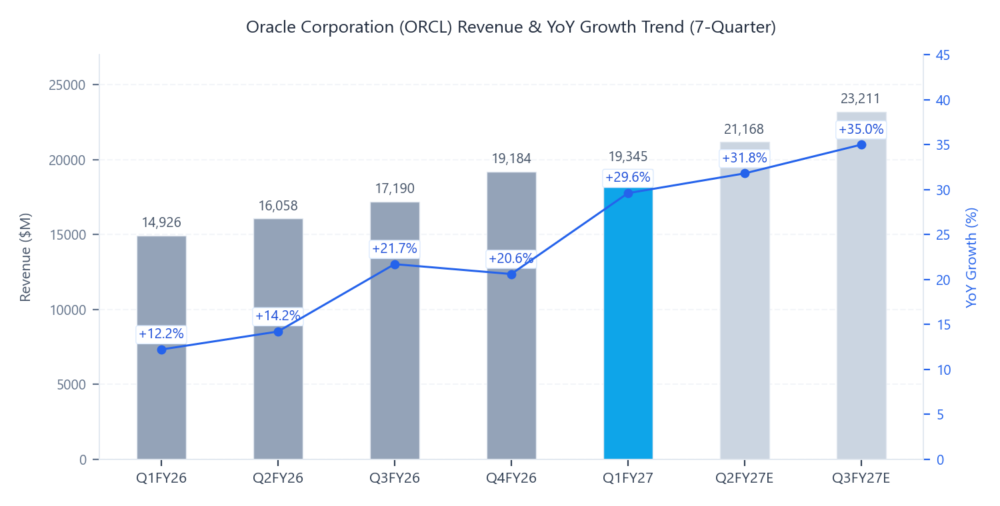
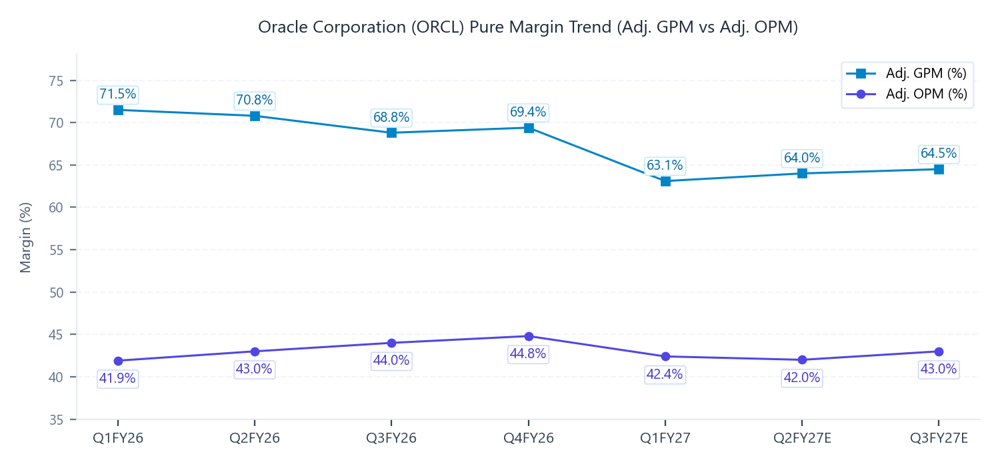

# Oracle Corporation (ORCL) Q1 FY27 Earnings Update
오라클 Q1 FY27 실적 분석 및 핵심 지표 리뷰

2026년 9월 11일

### Executive Snapshot
- 기준일자: 2026년 9월 11일
- 사업분야: 엔터프라이즈 클라우드 인프라(OCI), 클라우드 데이터베이스(Autonomous/AI), 엔터프라이즈 SaaS(Fusion/NetSuite)
- 현재주가: 161.50 USD (실적 직후 시간외 +5.60% / 정규장 종가 152.94 USD)
- 적정주가: 234.76 USD (현재 주가 대비 +45.4%)
- 산정근거: FY28E EPS 10.97 USD * Target P/E 21.4x

## ▌ 01. Executive Summary

### 핵심 실적 하이라이트
- [실적 더블 비트] 매출 19,345M USD (시장 컨센서스 19,129M USD 대비 +1.1% Beat) 및 Non-GAAP EPS 1.92 USD (컨센서스 1.74 USD 대비 +10.5% Beat) 동시 달성.
- [핵심 사업부 고성장] 클라우드 인프라(OCI) 매출 7,400M USD (+121.0% YoY) 폭증 및 잔여이행의무(RPO) 664B USD (QoQ +26B USD) 확보로 역대 최대 수주 잔고 경신.
- [수익성 체질 개선] 대규모 데이터센터 가동 선행비용 집행에도 SG&A 운영 효율화로 Non-GAAP OPM 42.4% 방어 및 영업이익 8,200M USD (+31.0% YoY) 달성.
- [가이던스 대폭 상향] FY27E 연간 매출 가이던스 최소 90.0B USD 이상 (기존 장기 전망 CAGR +31% 상회 수준인 +34.0% YoY) 및 연간 Non-GAAP EPS 8.05 USD -> 8.10 USD (+0.05 USD 상향) 델타 브릿지 확정.

### Q1 FY27 Results Summary Table (Non-GAAP 기준)
| 단위: M$ | 실제 | 컨센서스 | vs 컨센 | YoY | QoQ |
| :--- | :---: | :---: | :---: | :---: | :---: |
| 매출 | 19,345 | 19,129 | +1.1% | +29.6% | +0.8% |
| Adj. GP | 12,207 | 12,434 | -1.8% | +17.9% | -8.3% |
| Adj. GPM | 63.1% | 65.0% | -190bp | -630bp | -630bp |
| Adj. OI | 8,200 | 7,652 | +7.2% | +31.0% | -4.7% |
| Adj. OPM | 42.4% | 40.0% | +240bp | +50bp | -240bp |
| Adj. NI | 5,568 | 5,046 | +10.3% | +30.0% | -9.0% |
| Adj. EPS ($) | 1.92 | 1.74 | +10.5% | +30.0% | -9.0% |
| Adj. EBITDA | 10,086 | 9,450 | +6.7% | +66.8% | +12.3% |
| FCF | -5,000 | -4,200 | -19.0% | N/A | N/A |

### Key Takeaways
- OCI 인프라 가속화: 1분기에만 850MW 신규 용량(전년도 전체 공급량의 73%)을 가동하며 OCI 매출 성장률이 +121%로 직전 분기(+93%) 대비 가속화.
- 자본 모델 차별화: 고객 선급금(20B - 25B USD) 및 BYOH(고객 자체 칩 반입) 모델 확립으로 오라클 자체 자본 지출 부담 없이 97.9%의 기록적 가동률 달성.
- 멀티클라우드 및 에이전트 확장: 70개 리전 및 119개 AZ 확장, AWS 인터커넥트 출시, 에이전틱 AI 스튜디오로 미션 크리티컬 엔터프라이즈 데이터 파이프라인 장악.

## ▌ 02. 매출성장 및 분기별 궤적 분석

| 단위: M$ | Q1FY26 | Q2FY26 | Q3FY26 | Q4FY26 | Q1FY27 | Q2FY27E | Q3FY27E |
| :--- | :---: | :---: | :---: | :---: | :---: | :---: | :---: |
| 매출 | 14,926 | 16,058 | 17,190 | 19,184 | 19,345 | 21,168 | 23,211 |
| YoY | +12.2% | +14.2% | +21.7% | +20.6% | +29.6% | +31.8% | +35.0% |
| QoQ | -6.1% | +7.6% | +7.0% | +11.6% | +0.8% | +9.4% | +9.7% |

### 분기별 탑라인 궤적 해독
- 역사적 비수기 극복: 통상 계절적 피크인 4분기 직후 1분기는 전분기 대비 매출이 감소하는 계절성을 보였으나, 당 분기 사상 최초로 QoQ +0.8% 순차 성장을 기록하며 인프라 스케일링 효과 증명.
- OCI 인프라 폭발: 클라우드 인프라 매출이 7,400M USD (+121.0% YoY)를 기록하여 전체 성장을 견인. 텍사스 애빌린(Abilene) 131,000개 GPU 공급 및 850MW 전력 가동이 탑라인 급증으로 직결.
- SaaS 안정적 두 자릿수 성장: 전체 SaaS 매출은 +10% 성장했으며, 퓨전(Fusion) 애플리케이션은 +14%, 헬스케어 및 산업용 애플리케이션은 +20% 이상의 고성장세 유지.

## ▌ 03. 수익성 및 영업이익률(OPM) 진단

| 단위: M$ | Q1FY26 | Q2FY26 | Q3FY26 | Q4FY26 | Q1FY27 | Q2FY27E | Q3FY27E |
| :--- | :---: | :---: | :---: | :---: | :---: | :---: | :---: |
| Adj. GP | 10,672 | 11,369 | 11,827 | 13,314 | 12,207 | 13,548 | 14,971 |
| Adj. GPM | 71.5% | 70.8% | 68.8% | 69.4% | 63.1% | 64.0% | 64.5% |
| Adj. OI | 6,260 | 6,900 | 7,560 | 8,600 | 8,200 | 8,890 | 9,980 |
| Adj. OPM | 41.9% | 43.0% | 44.0% | 44.8% | 42.4% | 42.0% | 43.0% |
| GAAP OPM | 28.7% | 29.5% | 31.8% | 32.0% | 34.8% | 34.0% | 35.0% |
| Cons. OPM | 41.5% | 42.5% | 43.5% | 44.0% | 40.0% | 41.8% | 42.5% |

### 마진 궤적 및 수익성 동인 분석
- OPM 판정: High-level Plateau (42% - 45% 고점 밴드 안착 구간). 대규모 데이터센터 초기가동 고정비로 GPM이 전년 동기 대비 840bp 하락했으나, SG&A 비용 절감과 운영 레버리지에 힘입어 Adj. OPM 42.4% 방어 성공.
- Reconciliation Bridge: GAAP OPM(34.8%)과 Non-GAAP Adj. OPM(42.4%) 간 +760bp 격차는 주로 주식보상비용(SBC) 990M USD(+512bp 영향)와 무형자산 상각비 482M USD(+249bp 영향)에 기인.
- GPU 갱신 프리미엄: 1분기 갱신 대상 GPU(대다수 4년 이상 사용된 구형 포함)의 전량이 이전 계약 대비 +20% 프리미엄으로 갱신/재판매되며 감가상각 종료 이후의 추가 현금흐름 창출 능력 입증.

## ▌ 04. 가이던스 리비전 및 밸류에이션 (Guidance Revisions & Valuation)

### 실적 발표 전후 눈높이 변동 (컨센서스 vs 가이던스 반영)
| 주요 지표 | 기존 컨센서스 | 가이던스 반영 | 변동률 |
| :--- | :---: | :---: | :---: |
| 12개월 적정주가 | $215.00 | $234.76 | +9.2% |
| FY27E 매출 | $89,369M | $90,500M | +1.3% |
| FY27E EBITDA | $33,500M | $34,200M | +2.1% |
| FY27E EPS | $8.06 | $8.10 | +0.5% |
| FY28E 매출 | $130,738M | $132,500M | +1.3% |
| FY28E EBITDA | $51,000M | $52,000M | +2.0% |
| FY28E EPS | $10.97 | $11.15 | +1.6% |

### 리비전 핵심 동인 및 3대 투자 함의
- [단기 눈높이 변동 동인] 1분기 어닝 서프라이즈와 Q2 매출 가이던스(+30% - +34%) 및 연간 가이던스 상향(매출 최소 90.0B USD 이상, EPS 8.10 USD)으로 시장의 FY27E 눈높이가 일제히 상향 조정.
- [중장기 눈높이 변동 동인] 664B USD의 RPO 중 절반이 36개월 내 매출로 전환되는 구조적 파이프라인과 BYOH/선급금 기반 자본 효율적 확장으로 FY28-29년 외형 및 이익 추정치 상향 견인.
- [적정주가 및 밸류에이션 결론] 고성장 AI 하이퍼스케일러 리레이팅을 반영하여 FY28E EPS 10.97 USD에 Target P/E 21.4x를 적용, 적정주가를 234.76 USD로 도출.

### 적정주가 민감도 매트릭스
| Target P/E | Bear Case (EPS $9.80) | Base Case (EPS $10.97) | Bull Case (EPS $12.20) |
| :--- | :---: | :---: | :---: |
| 18.0x | $176.40 (+9.2%) | $197.46 (+22.3%) | $219.60 (+36.0%) |
| 20.0x | $196.00 (+21.4%) | $219.40 (+35.8%) | $244.00 (+51.1%) |
| 21.4x | $209.72 (+29.9%) | $234.76 (+45.4%) | $261.08 (+61.7%) |
| 23.0x | $225.40 (+39.6%) | $252.31 (+56.2%) | $280.60 (+73.7%) |
| 25.0x | $245.00 (+51.7%) | $274.25 (+69.8%) | $305.00 (+88.9%) |

### 밸류에이션
- [주당순이익(P/E) 밸류에이션] FY28E 예상 Non-GAAP EPS 10.97 USD에 AI 하이퍼스케일러 전환 가속화를 반영한 타깃 P/E 21.4x를 적용하여 적정주가 234.76 USD 도출.
- [현재 주가 대비 상승 여력] 현재 시간외 주가 161.50 USD 대비 산출된 적정 가치의 상승 여력은 +45.4% (정규장 종가 152.94 USD 대비 +53.5%) 수준으로 산출.

## ▌ 05. 주요 질의응답 (Earnings Call Q&A Highlights)

- RPO 및 자본 지출 분리 구조: 경영진은 신규 수주 계약의 대부분이 고객 선급금(Prepayments) 및 고객 자체 하드웨어 반입(BYOH)으로 체결되어 오라클의 추가 현금 지출을 수반하지 않는다고 명시. CapEx 지출과 사업 성장의 탈동조화(Decoupling)를 통해 자본 효율성을 극대화.
- 데이터센터 지연 루머 일축 및 전력 용량 가동: 시장에서 우려했던 뉴멕시코 및 위스콘신 사이트 지연설에 대해, 1분기 인도된 850MW는 해당 사이트 없이 달성된 수치이며 두 사이트 모두 2027 역년 상반기 인도 일정대로 순항 중임을 확인. 연간 실적 가이던스 영향 제로.
- 에이전틱 AI 스튜디오 및 조기 가동(Go-Lives) 혁신: 동일 컨트롤 플레인 상에서 구동되는 Fusion Agentic Studio와 AI Data Platform을 통해 엔터프라이즈 온톨로지를 자동화하고, 기존 수개월 소요되던 시스템 구축 기간을 수주일 단위로 압축하여 빠른 매출 인식 실현.

## ▌ 06. 리스크 요인 및 모니터링 지표 (Risks & Tracking Points)

- 대규모 설비투자에 따른 잉여현금흐름(FCF) 일시 마이너스: FY27 연간 총 CapEx 90B - 95B USD 집행으로 1분기 FCF -5.0B USD 기록. 선급금 20B - 25B USD 회수 및 프로젝트 램프업에 따른 세후 EBITDA 100% 현금 전환 여부 추적 필요.
- 전력 인프라 및 변전소 구축 일정 관리: 하이퍼스케일러 전력 수요 급증에 따른 발전 설비(블룸에너지 연료전지, 복합화력 가스 등)의 준공 승인 및 그리드 연결 지연 리스크 상존.
- 하드웨어 감가상각 및 부품가 변동: 신규 AI 클러스터 대규모 전입에 따른 단기 매출총이익률 희석 추세가 60% 선에서 안정화되는지 여부 및 GPU 갱신 프리미엄 지속 여부 모니터링 필수.
