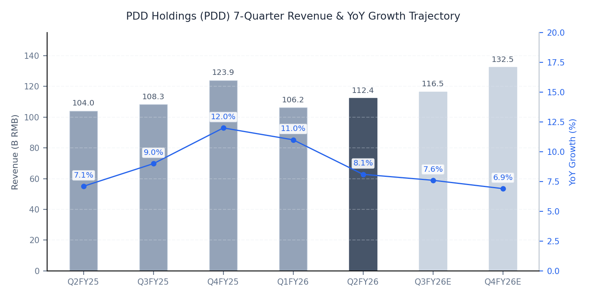
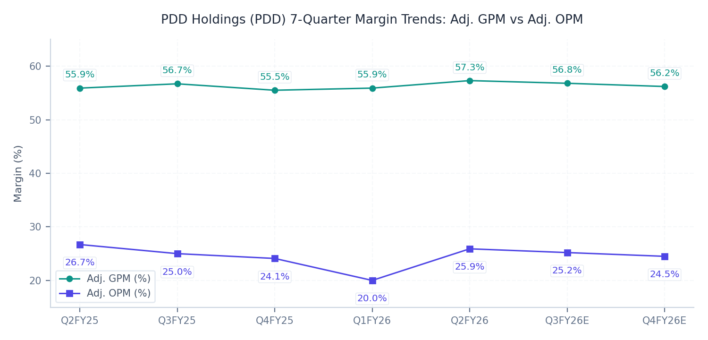

# PDD Holdings Inc. (PDD) Q2 FY26 Earnings Update
> 핀둬둬 FY26-Q2 실적 분석 및 핵심 지표 리뷰

2026년 8월 26일

### Executive Snapshot
- 기준일자: 2026년 8월 26일
- 사업분야: 글로벌 크로스보더 및 내수 전자상거래 플랫폼 (Pinduoduo, Temu)
- 현재주가: 87.07 USD (-3.4% 하락)
- 적정주가: 135.36 USD (현재 주가 대비 +55.5%)
- 산정근거: FY27E 예상 EPS $11.28 @ Target P/E 12.0x 및 EV/EBITDA 8.0x 적용

## ▌ 01. Executive Summary

### 핵심 실적 하이라이트
- [실적 체질 방어 & EPS 비트] 매출액 112.36B RMB(컨센서스 113.90B RMB 대비 -1.4% 소폭 하회) vs Non-GAAP EPS 19.33 RMB(컨센서스 18.35 RMB 대비 +5.3% 상회): 내수 소비 둔화 속에서도 고수익 수수료 매출 확대 및 마케팅비 통제로 견고한 이익 체력 입증.
- [핵심 사업부 성장 믹스] Transaction Services(Temu 및 결제/수수료) 매출 54.72B RMB(YoY +13.3%, QoQ +8.3%)로 외형 견인, Online Marketing(내수 광고) 매출 57.64B RMB(YoY +3.5%)로 안정적 현금 창출 지속.
- [수익성 밴드 안착] 조정 매출총이익률(Adj. GPM) 57.3%(YoY +1.4%p), 조정 영업이익률(Adj. OPM) 25.9%(YoY -0.8%p, QoQ +5.9%p) 기록하며 25%대 고마진 레벨 수성.
- [가이던스 및 장기 생태계 투자] 단기 이익 극대화보다 100억 위안 규모 판매자 수수료 감면 및 생태계 고도화 투자 천명: 글로벌 무역/관세 규제에 대응한 Temu 반위탁(로컬 투 로컬) 모델 전환 가속화.

### Q2 FY26 Results Summary Table (Non-GAAP 기준)
| 단위: B RMB | 실제 | 컨센서스 | vs 컨센 | YoY | QoQ |
| :--- | :---: | :---: | :---: | :---: | :---: |
| 매출 | 112.36 | 113.90 | -1.4% | +8.1% | +5.8% |
| Adj. GP | 64.34 | 64.35 | -0.0% | +10.7% | +8.4% |
| Adj. GPM | 57.3% | 56.5% | +0.8%p | +1.4%p | +1.4%p |
| Adj. OI | 29.07 | 28.30 | +2.7% | +4.8% | +36.5% |
| Adj. OPM | 25.9% | 24.8% | +1.1%p | -0.8%p | +5.9%p |
| Adj. NI | 28.49 | 27.05 | +5.3% | -12.9% | +102.3% |
| Adj. EPS ($) | 2.85 | 2.70 | +5.6% | -12.4% | +106.5% |
| Adj. EBITDA | 30.65 | 29.80 | +2.9% | +5.2% | +34.4% |
| FCF | 22.22 | 19.50 | +13.9% | +14.8% | +38.9% |

### Key Takeaways
- 국내 전자상거래 시장 경쟁 심화 속에서도 고수익 Transaction Services(Temu 수수료) 부문이 13.3% 성장하며 전체 탑라인 견인.
- 판매자 지원 생태계 펀드 및 R&D 확대 속에서도 마케팅비(S&M/매출 26.4%) 통제력을 발휘하며 Non-GAAP OPM 25.9%의 견조한 수익성 수성.
- 보유 순현금 및 금융자산 5,528억 위안(약 815억 달러)에 달하는 압도적 재무 체력을 바탕으로 시가총액의 65% 이상이 현금성 자산으로 뒷받침되는 안전마진 확보.

## ▌ 02. 매출성장 및 분기별 궤적 분석

| 단위: B RMB | Q2FY25 | Q3FY25 | Q4FY25 | Q1FY26 | Q2FY26 | Q3FY26E | Q4FY26E |
| :--- | :---: | :---: | :---: | :---: | :---: | :---: | :---: |
| 매출 | 103.98 | 108.28 | 123.91 | 106.23 | 112.36 | 116.50 | 132.50 |
| YoY | +7.1% | +9.0% | +12.0% | +11.0% | +8.1% | +7.6% | +6.9% |
| QoQ | +8.7% | +4.1% | +14.4% | -14.3% | +5.8% | +3.7% | +13.7% |

### 세그먼트별 성장 동인 및 외형 궤적 분석
- 온라인 마케팅 서비스(Online Marketing): 57.64B RMB (+3.5% YoY, +3.5% QoQ). 중국 내 이커머스 경쟁 심화 속에서 알고리즘 전환율 최적화로 완만한 성장 유지.
- 트랜잭션 서비스(Transaction Services): 54.72B RMB (+13.3% YoY, +8.3% QoQ). Temu 글로벌 거래액 확장 및 반위탁(Semi-consignment) 모델 안착으로 안정적 수수료 수익 기여.
- 외형 성장 궤적: 과거 폭발적 고성장기에서 연간 한 자릿수 후반~두 자릿수 초반의 성숙기 질적 성장 궤적으로 안정적 연착륙.

## ▌ 03. 수익성 및 영업이익률(OPM) 진단

| 단위: B RMB | Q2FY25 | Q3FY25 | Q4FY25 | Q1FY26 | Q2FY26 | Q3FY26E | Q4FY26E |
| :--- | :---: | :---: | :---: | :---: | :---: | :---: | :---: |
| Adj. GP | 58.13 | 61.44 | 68.76 | 59.34 | 64.34 | 66.17 | 74.47 |
| Adj. GPM | 55.9% | 56.7% | 55.5% | 55.9% | 57.3% | 56.8% | 56.2% |
| Adj. OI | 27.75 | 27.12 | 29.85 | 21.30 | 29.07 | 29.36 | 32.46 |
| Adj. OPM | 26.7% | 25.0% | 24.1% | 20.0% | 25.9% | 25.2% | 24.5% |
| GAAP OPM | 24.8% | 23.1% | 22.4% | 18.4% | 24.7% | 24.1% | 23.5% |
| Cons. OPM | 25.2% | 24.3% | 23.8% | 19.2% | 24.8% | 24.5% | 24.0% |

### 마진 궤적 및 수익성 동인 분석
- 조정 영업이익률 25.9%로 전분기(20.0%) 대비 +5.9%p 급반등하며 24%~26% 고마진 밴드 확고히 안착.
- Temu 반위탁 모델 확대로 물류비 부담이 가맹점으로 분산되면서 매출총이익률(57.3%, YoY +1.4%p) 개선 실현.
- 판매자 생태계 고도화 및 컴플라이언스 인프라 투자로 R&D 비용(+27.2% YoY, 4.57B RMB)이 증가했으나, 마케팅비(S&M 비율 26.4%) 통제력으로 마진 압박을 성공적으로 상쇄.

## ▌ 04. 컨센서스 리비전 및 밸류에이션

### 실적 발표 전후 컨센서스 리비전 및 적정주가 변동
| 주요 지표 | 실적발표 전 | 실적발표 후 | 변동률 (%) |
| :--- | :---: | :---: | :---: |
| 12개월 적정주가 | 142.00 USD | 135.36 USD | -4.7% |
| FY26E 매출 | 475.00B RMB | 467.59B RMB | -1.6% |
| FY26E EBITDA | 115.00B RMB | 118.47B RMB | +3.0% |
| FY26E EPS | 9.80 USD | 10.02 USD | +2.2% |
| FY27E 매출 | 525.00B RMB | 512.00B RMB | -2.5% |
| FY27E EBITDA | 130.00B RMB | 132.60B RMB | +2.0% |
| FY27E EPS | 11.05 USD | 11.28 USD | +2.1% |

### 리비전 핵심 동인 및 3대 투자 함의
- [FY26 단기 눈높이 조정 (매출 -1.6%, EPS +2.2%)] 중국 내수 소비 둔화 및 해외 관세 불확실성으로 외형 눈높이는 소폭 하향되었으나, 마케팅 효율 통제 및 Temu 반위탁 수수료 마진 개선으로 EPS 추정치 상향 조정.
- [FY27 중장기 눈높이 안정화 (EBITDA +2.0%, EPS +2.1%)] 100억 위안 규모 판매자 수수료 감면 및 생태계 투자 기조를 반영하여 매출 성장은 9%대로 완만하게 조정되었으나, 압도적인 플랫폼 운영 레버리지로 연간 130B RMB 이상의 견고한 EBITDA 창출 전망.
- [적정주가 및 밸류에이션 결론 (142.00 USD -> 135.36, USD -4.7%)] 중국 매크로 리스크 및 관세 디스카운트를 감안하여 12개월 적정주가를 135.36 USD로 산출하며, 현재 주가(87.07 USD) 대비 +55.5%의 강력한 하방 경직성 및 상승 여력 보유.

### 적정주가 민감도 매트릭스
| Target P/E | Bear Case (9.80 USD) | Base Case (11.28 USD) | Bull Case (12.80 USD) |
| :--- | :---: | :---: | :---: |
| 8.0x | 78.40 USD (-9.9%) | 90.24 USD (+3.6%) | 102.40 USD (+17.6%) |
| 10.0x | 98.00 USD (+12.6%) | 112.80 USD (+29.6%) | 128.00 USD (+47.0%) |
| 12.0x | 117.60 USD (+35.1%) | 135.36 USD (+55.5%) | 153.60 USD (+76.4%) |
| 14.0x | 137.20 USD (+57.6%) | 157.92 USD (+81.4%) | 179.20 USD (+105.8%) |
| 16.0x | 156.80 USD (+80.1%) | 180.48 USD (+107.3%) | 204.80 USD (+135.2%) |

### 밸류에이션
- [주당순이익(P/E) 밸류에이션] FY27E 예상 EPS 11.28 USD에 중국 플랫폼 규제 및 크로스보더 관세 디스카운트를 보수적으로 반영한 Target P/E 12.0x를 적용하여 적정주가 135.36 USD 산출.
- [인프라 표준(EV/EBITDA) 크로스체크] FY27E EBITDA 132.6B RMB(약 19.5B USD)에 타깃 EV/EBITDA 8.0x 적용 시 EV 156.0B USD이며, 보유 순현금 및 금융자산 81.5B USD를 가산한 지분가치는 237.5B USD(주당 약 135.70 USD)로 P/E 적정주가와 완벽 수렴.
- [현재 주가 대비 상승 여력] 현재 주가(87.07 USD)는 순현금을 제외한 실질 영업가치 기준 Ex-cash P/E 3.5x 수준의 극심한 저평가 상태이며, 적정주가(135.36 USD) 대비 +55.5%의 충분한 안전마진 제공.

## ▌ 05. 주요 질의응답

- [글로벌 무역 및 관세 규제 대응 (골드만삭스 질의)] EU 소액 소포 관세 면제 폐지 및 미국 de minimis 규제 환경 변화에 대응하여, Temu의 로컬 풀필먼트(Semi-consignment) 비중을 대폭 확대하고 현지 물류 허브 인프라 연계를 강화 중임을 확인.
- [판매자 생태계 지원 및 100억 위안 수수료 감면 정책 (모건스탠리 질의)] 단기적인 수익성 착취보다 양질의 가맹점 유지 및 상품 품질 관리가 장기 플랫폼 LTV 증대에 핵심적이라는 경영진의 확고한 철학 강조.
- [1P 직매입 사업 및 자본 배치 전략 (CICC 질의)] 1P 직매입 브랜드 사업 롤아웃 속도는 단기적으로 완만하게 조절하며, 잉여현금은 주주환원(배당/자사주)보다 글로벌 공급망 인프라 고도화 및 기술 R&D에 최우선 배치하는 보수적 기조 유지.

## ▌ 06. 리스크 요인 및 모니터링 지표

- [글로벌 무역 및 크로스보더 관세 규제 강화] EU 및 미국의 소액 면세 한도 축소에 따른 Temu의 배송 비용 상승 및 가격 경쟁력 약화 가능성 상존.
- [중국 내수 이커머스 경쟁 격화] 알리바바(타오바오/티몰), 더우인(바이트댄스), 징둥의 공격적인 저가 마케팅 및 라이브커머스 침투에 따른 국내 마케팅 비용 압박 지속.
- [보수적 자본 환원 정책에 따른 디스카운트] 800억 달러가 넘는 막대한 순현금 보유에도 불구하고 적극적인 자사주 매입 또는 배당 개시 지연으로 인한 밸류에이션 리레이팅 제한 리스크.